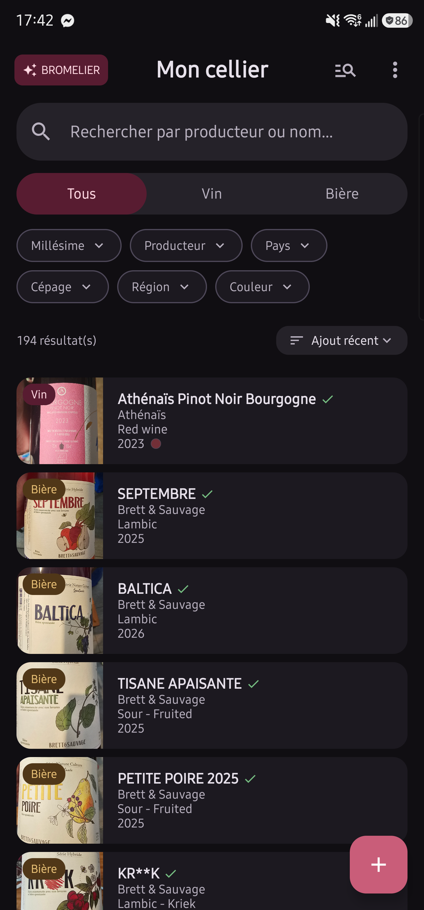
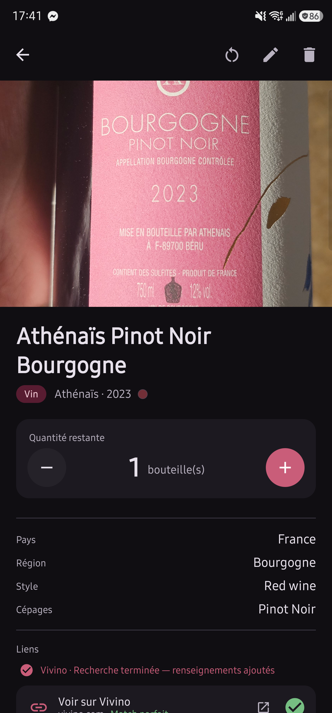
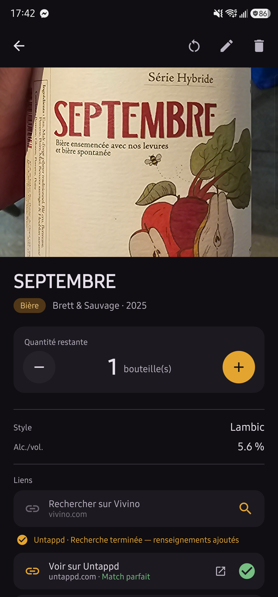
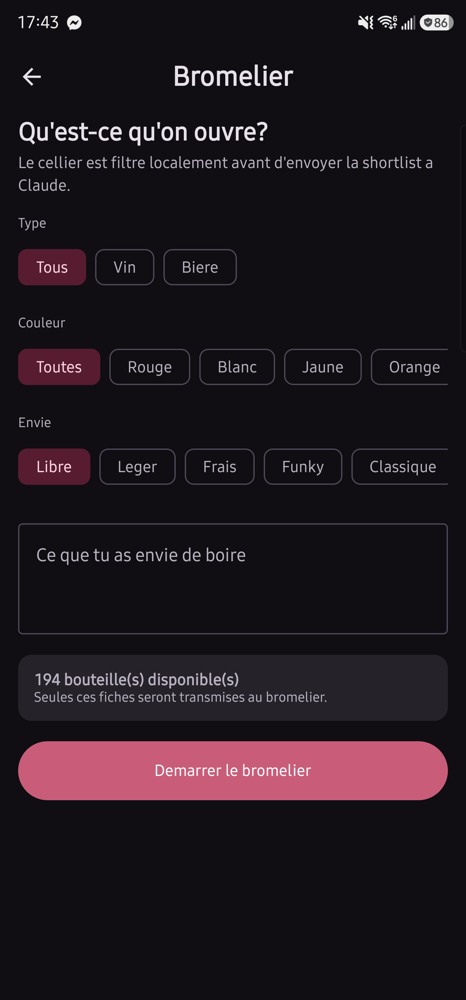

# Cellier Manager

Cellier Manager is a local-first Android application for managing a personal wine and beer cellar. The Android app remains fully usable on its own. Optional product enrichment is handled by a Windows companion and a dedicated Chrome profile, which lets the supported websites load normally before the visible product data is captured.

The current development release is **Android 2.1.14-dev**, **companion 0.2.13**, and **Chrome extension 0.6.8**.

## Highlights

- Local wine and beer inventory with photos, OCR-assisted entry, quantities, search, sorting, and detailed filters.
- Optional enrichment from SAQ, Vivino, and Untappd through a normal Chrome session, with visible progress and explicit match status.
- Bromelier, an optional conversational cellar advisor that recommends bottles already present in the inventory.
- Portable `.cellierbackup` archives containing the inventory, photos, and enrichment provenance.
- Offline-first daily use: the inventory remains available when the computer or enrichment service is offline.

## Screenshots

<table>
  <tr>
    <td align="center">
      <br>
      <strong>Main cellar</strong>
    </td>
    <td align="center">
      <br>
      <strong>Wine details</strong>
    </td>
  </tr>
  <tr>
    <td align="center">
      <br>
      <strong>Beer details</strong>
    </td>
    <td align="center">
      <br>
      <strong>Bromelier</strong>
    </td>
  </tr>
</table>

## How it works

The project has three components:

- `app/` contains the Kotlin Android application built with Jetpack Compose, Room, and WorkManager.
- `companion/` contains the local Python/FastAPI service, its SQLite job store, LAN TLS support, and source-specific parsers.
- `extension/` contains the Manifest V3 Chrome extension that handles SAQ, Vivino, and Untappd pages.

Android is the source of truth for the inventory. It never downloads SAQ, Vivino, or Untappd pages. The companion also does not scrape those sites over HTTP. Chrome loads each page through a normal browser session, the extension selects a matching product, and the companion parses the rendered product content.

The normal enrichment flow is:

1. Start the companion on the Windows computer.
2. Pair the Android app and Chrome extension once.
3. Start an SAQ, Vivino, or Untappd search from a bottle in the Android app.
4. The companion opens the dedicated Chrome profile and reports each search stage to Android.
5. The extension evaluates the results, opens a sufficiently strong match, and captures the product page.
6. Android validates the proposal, applies the accepted fields, and records their source.
7. Chrome closes automatically when the operation reaches a terminal state.

The product name and producer are updated to the canonical values found on the selected source when the identity match is strong. Quantity is never changed by enrichment. If the computer is unavailable, the cellar, photos, OCR, filters, editing, and quantity controls continue to work locally.

## Bromelier

Bromelier is an optional in-app cellar advisor powered by the official Anthropic Messages API. Android first narrows the available inventory locally by beverage type and wine colour, then sends only that shortlist together with the selected mood, free-text preference, and conversation to Claude. Its recommendations link back to bottles that are actually present in the cellar; Bromelier does not modify the inventory, trigger browser enrichment, or require the Windows companion. The user-provided Anthropic API key is encrypted at rest with Android Keystore and excluded from inventory backups.

The full design specification is in [architecture.md](architecture.md). Current implementation and audit notes are in [docs/audit-handoff.md](docs/audit-handoff.md), and setup instructions are in [docs/installation.md](docs/installation.md).

## Requirements

- Android Studio with JDK 17 and Android SDK 34
- Python 3.11 or newer
- Node.js 20 or newer
- Google Chrome on Windows for product enrichment
- An Anthropic API key for Bromelier (optional)

## Android development

Build and test the application from PowerShell:

```powershell
$env:JAVA_HOME = 'C:\Program Files\Android\Android Studio\jbr'
.\gradlew.bat :app:testDebugUnitTest :app:assembleDebug :app:compileDebugAndroidTestKotlin
```

The Room schema is version 7. Migration 6 to 7 preserves existing products and photos, adds portable identifiers and provenance records, converts grape lists to JSON, and neutralizes obsolete indexing work. Destructive migration is not enabled.

The application ID remains `com.cellier.manager`. Updating a phone that already contains an inventory requires an APK signed with the same signing key. Uninstalling the application deletes its local database and photos.

## Windows companion

Start the companion with:

```powershell
.\companion\start-companion.ps1
```

The script creates a virtual environment on first use and installs the pinned dependencies. The local administration page is available at `http://127.0.0.1:18765`. Android connects over HTTPS on port 8766 using the public certificate included in the pairing file.

Companion data is stored outside the repository under `%LOCALAPPDATA%\CellierManagerCompanion`. This includes its SQLite database, private TLS key, public certificate, Chrome profile, and pairing state.

Run its tests with:

```powershell
.\companion\.venv\Scripts\python.exe -m pytest companion\tests -q
```

## Chrome extension

Build and test the extension with:

```powershell
cd extension
npm ci
npm test
```

Load `extension/dist` as an unpacked extension from `chrome://extensions` with Developer mode enabled. Pairing can be completed through the extension popup, or automated with `scripts/setup_chrome_extension.mjs` when setting up the dedicated Chrome profile.

The extension has access only to the loopback companion and HTTPS pages on SAQ, Vivino, and Untappd. Its selection rules validate source-specific identity details before opening and capturing a product page. A page that cannot be validated is reported as an explicit failure instead of being silently applied.

## Backups and privacy

The Android settings screen exports a `.cellierbackup` archive containing every inventory item, including depleted items, provenance metadata, and available photos. Import validates the archive structure, size limits, hashes, and references before replacing data. A private safety backup is created before restoration.

Companion tokens and the optional Bromelier API key are encrypted with Android Keystore. API keys are not compiled into the APK. Pairing secrets are short-lived and single-use. Inventory backups exclude tokens, private certificates, network jobs, and captured web content.

Local configuration, API keys, device backups, generated packages, browser captures, build outputs, and dependency directories are excluded from Git.

## Release packages

After a successful Android build and extension build, create the local release packages with:

```powershell
.\companion\.venv\Scripts\python.exe scripts\package_release.py
```

Generated APK and ZIP files are written to `dist/` and are intentionally not committed.

## Validation

Run the main automated checks before committing:

```powershell
# Android
.\gradlew.bat :app:testDebugUnitTest :app:assembleDebug :app:compileDebugAndroidTestKotlin

# Companion
.\companion\.venv\Scripts\python.exe -m pytest companion\tests -q

# Extension
cd extension
npm test
```

Instrumented Android migration tests require an emulator or connected device. Before installing a development APK over the only copy of a real inventory, create and verify an external backup and confirm signing compatibility.

## License

This project is licensed under the MIT License. See [LICENSE](LICENSE).

The source code and the application are in French.

Conçu par Sébastien Bédard
