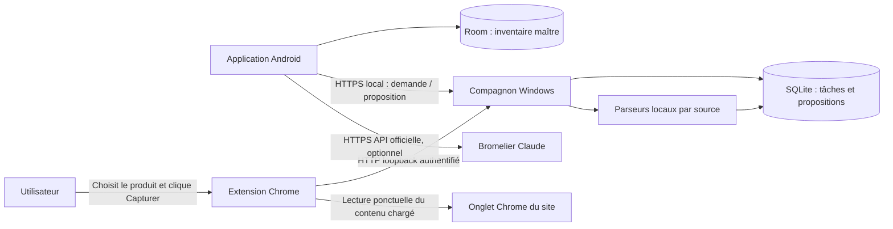

# Cellier Manager — Architecture de la refonte « V2 »

> Cahier de construction destiné à un agent de développement.
> Date : 20 septembre 2026.
> Référence : code présent dans `Y:\cellier-manager` et approche de `Y:\SudFinder`.
> Statut : cahier d’architecture original ayant guidé l’implémentation **Android + compagnon Windows + extension Chrome**.
> L’état réellement livré et les essais effectués sont consignés dans `README.md`, `CHANGELOG.md` et `docs/audit-handoff.md`.

### Repères de lecture

| Sections | Contenu |
|---|---|
| 0–3 | Mandat, décisions, existant et architecture |
| 4–5 | Parcours et organisation des fichiers |
| 6–9 | Données, protocole, transactions et reprise |
| 10–12 | Extension, extraction, réseau et appairage |
| 13–16 | Migration, sauvegarde, interface et Bromelier |
| 17–18 | Exploitation et tests |
| 19–21 | Ordre de construction, livrables et critères de fin |
| 22–23 | Prompt prêt à transmettre et références |

Les mécanismes décrits sont des prescriptions de conception. Les valeurs chiffrées de taille, rétention, délai et capacité sont des valeurs de départ à centraliser dans la configuration et à tester. Une adaptation de ces valeurs doit être documentée ; elle n’autorise pas à modifier les invariants de conservation des données, de validation utilisateur ou d’absence de scraping HTTP direct.

## 0. Instructions de départ pour l’agent

Lire ce document intégralement avant de modifier les invariants de la refonte. Le README décrit l’utilisation actuelle et le dossier d’audit décrit les écarts ou limites de l’implémentation. Les nouvelles instructions explicites du propriétaire restent prioritaires.

La finalité est une application personnelle fiable pour gérer des vins et des bières. Le problème principal à résoudre est l’entretien incessant d’une récupération de données qui dépend de requêtes bloquées, de services internes aux sites et de résultats IA incertains.

Construire les fonctionnalités par étapes vérifiables. Ne pas convertir ce cahier en une grande réécriture non testée. Ne pas dépenser des heures à contourner un site : une extraction partielle, clairement signalée et complétable à la main, est un résultat prévu par l’architecture.

Obligations de réalisation :

- Préserver l’inventaire existant, les identifiants, les quantités et les photos.
- Conserver l’application Android native et son usage hors ligne.
- Faire charger les pages des sources par le Chrome réel de l’utilisateur sur Windows.
- Ouvrir automatiquement le premier résultat qui satisfait la validation propre à la source : nom/producteur pour SAQ, cuvée/producteur/millésime pour Vivino et bière/brasserie/année pour Untappd. En cas de doute, échouer clairement sur Android sans exiger un accès au PC.
- Séparer la capture de page, l’extraction des renseignements et leur application à l’inventaire.
- Ne jamais transformer une erreur réseau en perte de données ou en fausse réussite.
- Livrer les tests, les instructions de démarrage et les éléments nécessaires à un audit.
- Ne pas modifier SudFinder : c’est une référence, pas une dépendance de la nouvelle application.
- Ne pas installer une nouvelle version sur le téléphone réel, ni restaurer sa base, sans instruction explicite du propriétaire. La compilation et les essais sur données de test peuvent avancer normalement.

La refonte s’appelle « V2 » dans ce document. L’implémentation actuelle utilise `versionName = 2.1.14-dev`, `versionCode = 224` et le schéma Room **7**. Toute version suivante doit conserver un `versionCode` supérieur à celui déjà installé sur le téléphone principal.

## 1. Décisions d’architecture

| Sujet | Décision ferme pour cette refonte |
|---|---|
| Usage principal | Android, français québécois, inventaire personnel |
| Appareil connu | Samsung Galaxy S23 Ultra ; conserver `minSdk = 26` |
| Source de vérité | Base Room de l’application Android |
| Rôle du PC | Aider ponctuellement à enrichir les fiches ; ne détient pas un second inventaire maître |
| Collecte web | Extension Manifest V3 dans un profil Chrome dédié à Cellier Manager |
| Déclenchement | Manuel ; aucune collecte périodique des sites |
| Choix du produit | Premier résultat automatique après validation forte propre à chaque source, sinon échec explicite et nouvelle tentative depuis Android |
| Application des données | Proposition fiable des trois sources : champs sûrs vides ou déjà confirmés; autres cas : prévisualisation et confirmation Android |
| Sources initiales | Vivino pour les vins, Untappd pour les bières, SAQ en complément |
| Communication | Réseau local ; téléphone et PC doivent pouvoir se joindre |
| Indisponibilité du PC | Consultation, création, modifications, photos, OCR et quantités restent disponibles |
| IA pour enrichir les fiches | Retirée du chemin de récupération et de validation des métadonnées |
| Bromelier | Conservé comme fonctionnalité facultative et séparée ; API officielle uniquement |
| Données importées | Toujours une proposition, jamais une écriture distante directe dans l’inventaire |
| Sauvegarde | Export/restauration complets explicites, distincts du CSV |
| Déploiement | Application personnelle, sans serveur public ni compte obligatoire |

### 1.1 Ce que signifie « inspiré de SudFinder »

Reprendre son principe : laisser Chrome charger le site normalement, puis récupérer localement le contenu chargé. Le navigateur exécute le JavaScript et utilise sa propre session. L’application ne reconstitue pas les appels internes du site. L’implémentation utilise un profil Chrome dédié afin de pouvoir le fermer entièrement après chaque opération sans toucher aux fenêtres personnelles de l’utilisateur.

Ne pas copier les fragilités présentes dans SudFinder :

- Un identifiant global `SUD_TASK_ID` peut associer une page à la mauvaise tâche.
- Des délais fixes de 4 ou 6 secondes ne prouvent pas qu’une page est prête.
- Un service worker d’extension peut être arrêté ; un `setInterval` ne garantit pas une exécution permanente.
- Un HTTP réussi ne signifie pas que l’extraction contient un produit utilisable.
- Ne jamais fermer les fenêtres Chrome personnelles : seuls les processus du profil dédié lancé par le compagnon peuvent être terminés automatiquement.
- Ne pas importer des pages entières contenant des renseignements inutiles lorsque la zone produit suffit.

Cette architecture réduit certaines causes de blocage. Elle ne promet pas l’absence de CAPTCHA, de changement de HTML ou de restriction côté site. Lorsque cela arrive, la tâche échoue avec un message exploitable sur Android et les données locales restent intactes. Aucun mécanisme de dissimulation ou de résolution automatique de CAPTCHA n’est prévu.

### 1.2 Hors périmètre

Pas de synchronisation bidirectionnelle de plusieurs inventaires, serveur cloud, compte utilisateur, abonnement, catalogue mondial, recherche automatique massive, historique des bouteilles consommées, notes de dégustation, notation personnelle, emplacement par casier, multiples photos par fiche ou nouvelle application web de gestion complète.

L’extension n’utilise ni navigateur headless, ni Playwright/Selenium en production, ni proxy rotatif, ni modification d’empreinte, ni service de résolution de CAPTCHA. L’IA n’invente ni lien produit ni renseignement manquant.

## 2. État du projet et stratégie de réutilisation

Le projet fourni comporte environ 8 700 lignes réparties dans 29 fichiers Kotlin. Il utilise Kotlin 2.0.20, AGP 8.5.2, Gradle 8.9, Java 17, Compose, Room 2.6.1, WorkManager, OkHttp, Jsoup, Coil et ML Kit.

Conserver d’abord la matrice de dépendances existante afin d’obtenir une compilation de référence. Une mise à niveau n’est pas une condition de la refonte : la faire séparément si une nouvelle bibliothèque l’exige. Épingler toutes les nouvelles versions et enregistrer la matrice réellement testée. Les documentations publiques peuvent montrer des API plus récentes que celles du dépôt ; ne pas recopier leurs exemples sans adapter les versions.

| Élément actuel | Traitement |
|---|---|
| `MainActivity`, navigation Compose, thème | Réutiliser et adapter progressivement |
| Écran de consultation, filtres, quantités | Conserver les comportements utiles ; simplifier les composants si nécessaire |
| Création, caméra, OCR local | Réutiliser avec gestion des brouillons et fichiers orphelins |
| `CellarItem`, DAO, base Room | Migrer sans effacer ; introduire des écritures ciblées |
| `CellarRepository` | Scinder inventaire, enrichissement, sauvegarde et liens |
| `ProductIndexer` | Retirer du chemin de production ; ne pas le déplacer tel quel sur le PC |
| `VivinoParser`, `UntappdParser` | Référence de champs et de fixtures uniquement ; aucune requête HTTP à conserver |
| `IndexingWorker` | Annuler l’ancien travail ; remplacer par un transport vers le compagnon |
| `SearchCache` | Entité de compatibilité seulement ; table conservée, DAO et chemin d’exécution retirés |
| `AiQuotaStore` | Retirer les quotas des anciens fournisseurs d’enrichissement |
| `ClaudeSommelierClient` | Conserver l’idée d’un client API isolé ; corriger annulation, erreurs et configuration |
| `CsvExporter` | Conserver l’export lisible ; ne pas le présenter comme sauvegarde complète |
| Anciens fichiers `Test*`, `Patch.kt`, HTML/JSON à la racine | Vérifiés puis exclus du dépôt Git ; aucun ne participe au build |

Risques observés dans la version d’origine et traités pendant la refonte :

1. Réenregistrement d’un ancien `CellarItem` après un appel réseau, pouvant annuler une quantité ou une modification récente.
2. Remplacement de champs manuels par des données web malgré des commentaires indiquant le contraire.
3. Correspondances jugées exactes trop facilement, notamment avec un premier résultat SAQ non réellement validé.
4. `fallbackToDestructiveMigration()` encore présent.
5. Absence de tests automatisés dans les répertoires de sources fournis.
6. Réinitialisation du chat qui n’annule pas une réponse en cours.
7. Clés de fournisseurs copiées dans `BuildConfig` et donc dans l’APK.

La copie fournie n’avait pas de dépôt Git détectable à sa racine au moment de l’analyse initiale. Avant le premier commit, exclure les secrets, bases personnelles, APK, sauvegardes et caches ; aucun envoi distant automatique n’est requis.

## 3. Architecture générale



### 3.1 Application Android

Responsable de l’inventaire, des photos, de l’OCR, des filtres, des opérations de quantité, des demandes d’enrichissement, de la comparaison et de la confirmation des propositions. Elle contrôle toutes les écritures dans son inventaire.

### 3.2 Compagnon Windows

Petit service Python local avec FastAPI, Uvicorn, Pydantic et SQLite. Interface locale HTML/JavaScript simple pour état, appairage, tâches et diagnostic. Utiliser les bibliothèques standard pour l’accès SQLite, BeautifulSoup pour l’extraction HTML et une bibliothèque reconnue pour les certificats. Pas de Streamlit nécessaire : ce composant n’est pas un tableau de bord d’analyse.

Le compagnon persiste les tâches et les résultats. Il ne charge jamais une URL Vivino, Untappd ou SAQ lui-même. Il analyse uniquement les captures envoyées par l’extension.

### 3.3 Extension Chrome

Manifest V3, TypeScript compilé localement, modules courts, aucune ressource exécutable distante. Interface popup pour liste de tâches, ouverture de recherche, association de l’onglet et capture manuelle de secours. Le service worker automatise le premier résultat validé de SAQ, Vivino et Untappd au moyen de règles propres à chaque source. Les états nécessaires à une reprise sont enregistrés, jamais seulement conservés en variable globale.

### 3.4 Réseau et disponibilité

Android est client ; aucun serveur HTTP permanent sur le téléphone. Le compagnon a deux interfaces distinctes :

- `http://127.0.0.1:18765` : interface PC et API de l’extension, accessibles uniquement depuis le PC. Ce port distinct évite les conflits avec les autres services locaux courants.
- `https://<adresse-LAN-du-PC>:8766` : API Android avec certificat appairé et jeton.

Ces ports sont des valeurs par défaut configurables, conservées dans un seul fichier de configuration. Si un port est occupé, afficher une erreur précise ; ne pas arrêter un programme tiers. Ne pas réutiliser les ports 8001/8501 de SudFinder.

L’absence de PC n’empêche pas l’ajout d’une bouteille. La demande d’enrichissement est enregistrée sur le téléphone et envoyée plus tard. Il n’existe aucune promesse de récupération en temps réel en arrière-plan : le bouton Actualiser et le retour dans l’application restent les mécanismes fiables.

## 4. Parcours utilisateur

### 4.1 Première utilisation

1. Ouvrir Android : l’inventaire est utilisable sans configuration réseau.
2. Sur Windows, démarrer le compagnon avec un lanceur unique.
3. Charger l’extension décompressée dans Chrome, conformément au guide fourni.
4. Dans la page locale du compagnon, créer un code d’appairage d’extension ; le coller dans les réglages de l’extension.
5. Dans Android, choisir « Connecter mon ordinateur » et scanner le QR affiché par le compagnon. Prévoir aussi l’import d’un fichier de configuration d’appairage par le sélecteur Android ; pas de longue empreinte à recopier à la main.
6. Afficher le nom du PC et demander une confirmation de connexion.
7. Afficher séparément « Ordinateur joignable » et « Extension vue récemment ». Ne pas confondre ces deux états.

Sur refus caméra ou indisponibilité du scanner QR, l’import de fichier permet de terminer l’appairage. La lecture QR se fait localement ; une bibliothèque Android de lecture de codes peut être ajoutée, épinglée et documentée. Ne pas écrire un décodeur QR maison.

### 4.2 Créer une bouteille

Photo, type vin/bière, producteur, nom, millésime et couleur facultative pour le vin. Préserver la règle actuelle du millésime requis à la création d’un vin ; proposer explicitement « Sans millésime » pour les vins concernés, sérialisé par `vintage = null`. Ne pas employer `0`, `NV` ou une année fictive pour cette valeur.

La quantité initiale est 1. La photo reste requise pour une nouvelle fiche, mais une ancienne fiche dont la photo manque demeure consultable et modifiable.

Enregistrer immédiatement dans Room. L’OCR sert seulement à aider la saisie. Après enregistrement, proposer « Compléter les renseignements » ; aucune recherche implicite.

### 4.3 Demander un enrichissement

1. Depuis une fiche, choisir Vivino, Untappd ou SAQ selon le type.
2. Enregistrer une demande avec l’identité actuelle du produit.
3. Si le PC est absent : « Recherche enregistrée. Elle sera envoyée quand l’ordinateur sera disponible. »
4. Lorsque le PC confirme réception : « Recherche en cours sur l’ordinateur ».
5. Le compagnon ouvre automatiquement le profil Chrome dédié sur la recherche officielle du site. Le nom, le producteur et le millésime sont correctement encodés dans la requête.
6. L’extension examine les résultats et ouvre la fiche qui satisfait les critères propres à la source : nom/producteur pour SAQ, cuvée/producteur/millésime pour Vivino, bière/brasserie/année pour Untappd.
7. Si aucun résultat ne peut être validé, la demande échoue explicitement et peut être relancée depuis Android ; le parcours quotidien ne demande aucune intervention sur le PC.
8. La fiche validée est capturée automatiquement.
9. Le compagnon analyse la capture et crée une proposition ou une erreur explicite.
10. Android récupère la proposition, applique les champs sûrs lorsque permis ou affiche « Renseignements à vérifier ».

Pendant les étapes 3 à 10, Android affiche la progression persistée par le compagnon : demande reçue, recherche Chrome, navigation vers le produit, capture, analyse et fin. Une demande qui reste `QUEUED` plus de 30 secondes indique que Chrome ou l’extension ne répond pas. Une connexion impossible au compagnon indique plutôt que l’ordinateur est inaccessible. Ces deux pannes ne doivent jamais être présentées sous le même message.

Chaque source choisit au plus une fiche validée. Une tâche ne crée jamais plusieurs onglets à la suite d’une simple reprise réseau.

Après une capture réussie ou un échec terminal, l’extension et le compagnon ferment toutes les fenêtres du profil dédié. Le compagnon lance ce profil avec le mode d’arrière-plan désactivé afin que le processus se termine aussi.

### 4.4 Vérifier et appliquer

Une proposition SAQ, Vivino ou Untappd marquée `PLAUSIBLE` ou `MATCH`, sans conflit de millésime et issue d’une URL produit canonique peut être appliquée automatiquement. Le nom et le producteur adoptent les valeurs canoniques observées sur la source ; les métadonnées sûres sont ajoutées ou rafraîchies. Le type et la quantité ne sont jamais modifiés par l’enrichissement. Toute proposition insuffisante ou incompatible est refusée.

L’écran de comparaison affiche : produit attendu, titre/page capturée, domaine, date de capture et millésime réellement observé ou « Non indiqué ».

Pour chaque champ, montrer « Actuel » et « Proposé ». Les valeurs proposées pour les champs vides peuvent être présélectionnées, sauf champ explicitement vidé par l’utilisateur. Une valeur existante différente n’est jamais présélectionnée pour remplacement.

Un millésime manquant sur la page n’est pas une confirmation du millésime de la bouteille. Un conflit de millésime bloque l’application automatique.

Les boutons sont « Appliquer les champs sélectionnés », « Garder seulement le lien », « Rejeter » et « Ouvrir la source ». Ne jamais rendre obligatoire l’acceptation de tous les champs.

Les valeurs sont appliquées dans une seule transaction locale après relecture de la fiche et contrôle de sa version. Une modification concurrente entraîne une nouvelle comparaison, sans écriture partielle.

### 4.5 Saisie de secours

Si la capture n’est pas exploitable, afficher une erreur sur Android et conserver la demande relançable. Une saisie locale explicite des champs peut rester disponible dans Android ; elle passe par une validation distincte et ne lance pas un nouveau scraper.

Un lien partagé depuis Chrome Android peut être associé à une fiche ou devenir une demande à traiter sur PC. Recevoir une URL ne donne pas accès au contenu de l’onglet Android : ne pas présenter cette action comme une importation complète.

### 4.6 Consultation et quantités

Conserver recherche, tri, filtres par type, producteur, millésime, pays, région, cépage et couleur. La recherche ignore casse et accents ; les filtres respectent les valeurs normalisées sans modifier le texte stocké.

Une quantité à zéro masque la fiche de l’inventaire courant sans la supprimer. Ajouter une vue secondaire « Épuisés » pour retrouver et réapprovisionner ces fiches. Cela ne constitue pas un historique de consommation.

Les boutons `+` et `−` effectuent des mises à jour SQL atomiques. Une proposition d’enrichissement ne contient jamais de quantité à appliquer.

## 5. Organisation du code

Conserver un module Android `app` au départ. La séparation par packages est suffisante ; ne pas créer une dizaine de modules Gradle.

```text
cellier-manager/
  architecture.md
  app/
    schemas/                         # Schémas Room suivis dans Git
    src/main/java/com/cellier/manager/
      app/                           # Container de dépendances, démarrage
      data/local/                    # Entities, DAO, migrations
      data/repository/               # Implémentations des interfaces métier
      domain/model/
      domain/usecase/                # ApplyProposal, ChangeQuantity, etc.
      enrichment/                    # Client compagnon, outbox, comparaison
      backup/                        # Archive, validation, restauration
      photo/                         # Capture, fichiers, nettoyage
      ocr/
      sommelier/                     # API Claude, session, shortlist
      ui/navigation/
      ui/screens/
      ui/components/
      ui/viewmodel/
    src/test/
    src/androidTest/
  companion/
    pyproject.toml
    requirements.lock               # Ou équivalent verrouillé, un seul mécanisme
    src/cellier_companion/
      app.py
      config.py
      api/android.py
      api/extension.py
      api/local_ui.py
      services/jobs.py
      services/pairing.py
      services/extraction.py
      storage/database.py
      storage/migrations/
      parsers/base.py
      parsers/vivino.py
      parsers/untappd.py
      parsers/saq.py
      security/
      static/
      templates/
    tests/
  extension/
    manifest.json
    package.json
    package-lock.json
    src/background.ts
    src/popup/
    src/options/
    src/capture/
    src/storage/
    tests/
  contracts/
    protocol-v1.md
    schemas/                         # JSON Schema versionnés
    examples/                        # Requêtes/réponses sans secrets
  fixtures/
    vivino/
    untappd/
    saq/
  docs/
    setup-windows.md
    setup-android.md
    migration.md
    verification.md
    audit-handoff.md
  scripts/
    start-companion.ps1
    stop-companion.ps1
```

Utiliser un conteneur d’injection explicite et simple côté Android. Les ViewModels dépendent d’interfaces de repository ou de cas d’usage ; ils ne construisent pas de clients HTTP ni de singleton global caché. Pas de framework d’injection obligatoire.

Le code métier de comparaison et de validation doit être testable sans Android ni réseau. Le parsing PC est une fonction pure de capture vers résultat typé. L’accès HTTP et l’accès base restent dans leurs couches dédiées.

## 6. Modèle local Android et invariants

### 6.1 Identifiants

- `itemId` : conserver le `Long` Room actuel, pour navigation et relations locales.
- `itemUuid` : UUID stable ajouté à chaque fiche ; utilisé dans les échanges.
- `datasetId` : UUID de l’inventaire, stocké dans `app_meta`. Conservé dans les sauvegardes et lors d’une restauration de ce même inventaire.
- `installationId` : UUID du client Android ; distinct du dataset, exclu des sauvegardes portables. Une nouvelle installation reçoit une nouvelle identité de transport.
- `requestId`, `captureId`, `proposalId`, `operationId` : UUID indépendants.
- Timestamps de protocole : UTC RFC 3339 ; timestamps de base : epoch millisecondes `Long`.

Ne jamais retrouver une bouteille par nom seul, ni utiliser son titre comme clé de synchronisation. L’association complète d’une demande est `(installationId, datasetId, itemUuid, requestId)`.

### 6.2 Table `cellar_items`, schéma Room 7

Conserver les colonnes existantes dans la première migration. Ajouter :

| Colonne | Type / règle |
|---|---|
| `itemUuid` | TEXT non nul, unique ; UUID attribué à la migration |
| `metadataRevision` | INTEGER non nul, défaut 0 |
| `identityRevision` | INTEGER non nul, défaut 0 |
| `updatedAt` | INTEGER non nul ; initialisé avec `created_at` |

`metadataRevision` augmente lorsque les métadonnées, la photo ou les liens sont modifiés, même si cette modification vient d’une importation approuvée. `identityRevision` augmente uniquement si producteur, nom, millésime ou type changent. Les modifications de quantité mettent `updatedAt` à jour mais ne changent pas ces deux révisions.

Les anciens champs `isSyncPending`, `syncFailed`, `syncAttempts`, `syncFailureReason`, `vivinoMatchQuality` et `untappdMatchQuality` restent physiquement présents pendant cette livraison pour faciliter la migration. Le nouveau code ne les utilise plus comme état des nouvelles recherches. Les nouveaux écrans ne les lisent pas pour décider qu’un produit est exact.

Conserver `saqUrl`, `vivinoUrl`, `untappdUrl` comme liens courants ; ne pas créer une seconde table contenant une autre « URL courante ». L’historique des propositions conserve leur propre URL source.

Pour `grapes`, migrer le texte au format JSON de tableau et remplacer le convertisseur à la même version de schéma. La migration décode l’ancien format délimité par `|` en respectant `\|` comme caractère littéral ; elle ne réutilise pas le `split("|")` défectueux. Documenter qu’une valeur déjà endommagée avant migration ne peut pas être reconstruite avec certitude. Les nouvelles écritures utilisent exclusivement JSON.

### 6.3 Nouvelles tables

**`app_meta`** : `key TEXT PRIMARY KEY`, `value TEXT NOT NULL`. Contient notamment `datasetId`, version du format de sauvegarde et marqueurs de reprise locale. Les secrets ne vont pas ici.

**`field_origins`** : clé primaire `(itemId, fieldName)` avec FK `ON DELETE CASCADE` vers la fiche.

- `origin` : `MANUAL`, `OCR_CONFIRMED`, `LEGACY`, `WEB_CONFIRMED`.
- `source` et `sourceUrl` : nullable, pour web confirmé.
- `proposalId` : nullable, identifiant de provenance sans FK bloquant sa purge.
- `changedAt` : timestamp.
- `explicitlyCleared` : booléen ; empêcher le remplissage présélectionné d’un champ volontairement vidé.

**`enrichment_requests`** :

- `requestId` PK, `datasetId`, `itemUuid`, `itemId` FK cascade.
- `source` : `VIVINO`, `UNTAPPD`, `SAQ`.
- `identitySnapshotJson`, `identityRevisionAtRequest`.
- `state`, `serverState`, `serverRevision`.
- `createdAt`, `updatedAt`, `lastErrorCode`, `lastErrorMessage`.
- `supersedesRequestId` nullable pour une relance explicite.

**`enrichment_proposals`** :

- `proposalId` PK, `requestId` FK cascade.
- `payloadJson`, `payloadSha256`, `receivedAt`.
- `state` : `PENDING`, `APPLIED`, `REJECTED`, `STALE`.
- `appliedAt`, `selectedFieldsJson` nullable.

**`outbox_operations`** :

- `operationId` PK, `kind`, `aggregateId`, `payloadJson`, `payloadSha256`.
- `attempts`, `nextAttemptAt`, `state`, `lastErrorCode`.
- Types initiaux : `CREATE_REQUEST`, `OPEN_REQUEST`, `CANCEL_REQUEST`, `ACK_PROPOSAL`.
- Pas de FK cascade pour les notifications d’annulation : une suppression de fiche ne doit pas effacer l’annulation restant à transmettre. Le payload contient les identifiants nécessaires.

Un index unique empêche plusieurs opérations actives identiques pour le même agrégat et la même action. Les propositions déjà appliquées ne peuvent pas être appliquées une seconde fois.

### 6.4 Invariants à rendre vrais dans le code

1. `quantity >= 0` et un enrichissement n’écrit jamais cette colonne.
2. Une fiche à zéro reste dans la base et dans la sauvegarde complète.
3. `name` et `producer` non vides pour une nouvelle saisie ou modification d’identité.
4. Pas de suppression automatique d’une ancienne valeur atypique pendant migration.
5. `alcoholVolume` entre 0 et 100 pour les nouvelles saisies ; nombre fini obligatoire.
6. `ibu` entier entre 0 et 1000 pour les nouvelles saisies, sinon erreur de validation ; ne pas tronquer silencieusement.
7. Un nouveau millésime est une année à quatre chiffres de 1800 à année courante + 1, ou null. Une valeur historique atypique reste conservée et est signalée si l’utilisateur la modifie.
8. Type et couleur : la couleur est null pour une bière.
9. Les listes sont bornées : 30 cépages, 100 caractères par cépage ; champs nom/producteur 200 caractères, région/style 200, pays 100, URL 2048. Les captures trop longues sont signalées, jamais tronquées en données prétendument complètes.
10. Une valeur `null` dans une proposition signifie « non observée », jamais « supprimer le champ ».
11. Une réponse tardive ne recrée pas une fiche supprimée.
12. Une donnée web n’est pas une instruction pour le programme ou pour un modèle IA.

### 6.5 Écritures métier

Interdire l’usage de `dao.update(itemAvantAppelReseau.copy(...))` pour tout résultat asynchrone. Préférer des DAO ciblés et des transactions.

Contrats indicatifs :

```kotlin
suspend fun changeQuantity(itemId: Long, delta: Int): QuantityResult
suspend fun saveManualPatch(itemId: Long, expectedRevision: Long, patch: MetadataPatch): SaveResult
suspend fun createEnrichmentRequest(itemId: Long, source: Source): RequestId
suspend fun receiveProposal(proposal: ProposalEnvelope): ReceiveResult
suspend fun applyProposal(command: ApplyProposalCommand): ApplyResult
suspend fun rejectProposal(proposalId: String): Unit
suspend fun deleteItem(itemId: Long): DeleteResult
```

`MetadataPatch` utilise un état par champ `Unchanged / Set(value) / Clear`, afin de distinguer champ absent et effacement explicite. `quantity`, `createdAt`, identifiants et chemins de stockage ne sont jamais acceptés dans un patch web.

Appliquer une proposition :

```text
Transaction Room :
  charger proposition + demande + fiche
  vérifier datasetId, itemUuid, requestId, identité attendue
  si proposition déjà appliquée : retourner ALREADY_APPLIED
  si fiche absente ou proposition périmée : refuser sans écriture
  si identityRevision diffère : retourner IDENTITY_CHANGED
  si metadataRevision != révision affichée dans la comparaison : retourner CONFLICT
  valider chaque champ explicitement sélectionné
  écrire exclusivement ces champs et le lien choisi
  augmenter metadataRevision ; augmenter identityRevision si nécessaire
  écrire field_origins
  marquer la proposition APPLIED
  insérer ACK_PROPOSAL dans l’outbox
Commit
```

Les boutons quantité restent utilisables durant une recherche et durant la comparaison. Une quantité modifiée ne rend pas la proposition périmée. Une modification du nom ou du millésime invalide les demandes ouvertes et nécessite une nouvelle demande ; ne pas réaffecter l’ancienne capture.

## 7. Stockage du compagnon

Utiliser `%LOCALAPPDATA%\CellierManagerCompanion\` pour configuration, base, journaux et certificats. Le code source ne contient pas les données d’exploitation. Mode test : répertoire temporaire distinct.

SQLite avec migrations SQL explicites, clés étrangères actives, `busy_timeout` et transactions courtes. Ne pas laisser une transaction ouverte pendant une interaction navigateur. Les deux listeners partagent la même couche de services et la même base ; éviter deux planificateurs indépendants.

Tables minimales :

- `devices` : identifiant client, rôle `ANDROID` ou `EXTENSION`, nom, hash du jeton, date de création, révocation, dernier contact.
- `pairing_sessions` : hash du secret temporaire, rôle attendu, expiration, date de consommation.
- `jobs` : requestId unique, propriétaire Android, datasetId, itemUuid, identité demandée, source, état, révision, dates, lease éventuel.
- `captures` : captureId unique, requestId, hash de capture, enveloppe de capture, état de traitement, parserVersion, date.
- `proposals` : proposalId unique, captureId unique, requestId, payload validé, statut de réception/application.
- `idempotency_records` : client, méthode, route, clé, hash du corps, réponse enregistrée.
- `schema_migrations` : version appliquée.

Le PC ne reçoit pas la photo de la bouteille, sa quantité ou tout l’inventaire pour une recherche. Il reçoit uniquement l’identité nécessaire à la tâche et la capture produit.

Rétention : captures brutes 7 jours ; tâches terminales et propositions 30 jours ; tâches sans intervention expirent après 30 jours. Les demandes ouvertes expirées restent lisibles sur Android. Purger les tâches parent seulement quand leurs données dépendantes peuvent être purgées. Garder les tombstones d’identifiants et les résultats d’idempotence au moins 90 jours afin qu’un ancien envoi ne recrée pas silencieusement une tâche terminée.

Une proposition non encore reçue par le téléphone est conservée jusqu’à l’expiration de sa tâche. Afficher l’expiration ; ne pas promettre une conservation illimitée sur le PC. L’utilisateur peut relancer avec un nouveau requestId.

## 8. Protocole de communication v1

### 8.1 Règles communes

- JSON UTF-8, objets typés, `protocolVersion: 1` sur les enveloppes.
- API Android sous `/api/v1/`, API extension sous `/extension/v1/`.
- Authentification `Authorization: Bearer <jeton>` sauf santé minimale et appairage.
- Toutes les mutations Android portent `Idempotency-Key: <operationId>`.
- Même clé et même corps : même résultat sans répétition d’effet. Même clé et corps différent : HTTP 409 `IDEMPOTENCY_CONFLICT`.
- Contrôler le propriétaire de chaque requestId, pas seulement l’existence d’un jeton valide.
- Les champs JSON inconnus d’une requête mutante sont refusés ; les clients peuvent ignorer les nouveaux champs optionnels d’une réponse.
- Une version majeure inconnue renvoie 426 `PROTOCOL_UNSUPPORTED`, sans modification.
- Aucune URL reçue par l’API ne provoque une requête web du backend.
- Fournir les JSON Schema, exemples et tests de conformité utilisés par Python, TypeScript et Kotlin.

### 8.2 Endpoints Android

| Méthode et route | Effet |
|---|---|
| `GET /api/v1/health` | Version protocole/service, sans inventaire ni secrets |
| `POST /api/v1/pair` | Échange d’un secret temporaire Android contre un jeton révocable |
| `POST /api/v1/requests` | Crée une tâche de manière idempotente |
| `POST /api/v1/requests/{id}/open` | Rouvre Chrome pour une tâche existante, une seule fois par clé d’idempotence |
| `GET /api/v1/requests/{id}` | État et serverRevision de la tâche |
| `POST /api/v1/requests/status` | États d’au plus 100 identifiants appartenant au client |
| `GET /api/v1/requests/{id}/proposal` | Proposition courante validée, ou 204 si absente |
| `POST /api/v1/requests/{id}/cancel` | Annulation idempotente |
| `POST /api/v1/proposals/{id}/ack` | Reçu, appliqué ou rejeté côté Android |

`ack` distingue `RECEIVED`, `APPLIED`, `REJECTED`. Le serveur ne marque jamais APPLIED simplement parce qu’Android a téléchargé une proposition. Une confirmation APPLIED n’arrive qu’après la transaction Room réussie.

Précision des états : `RECEIVED` laisse la tâche serveur READY et enregistre `receivedAt`. `APPLIED` ou `REJECTED` rend la tâche ACKED avec une colonne `resolution` correspondante. Un ACK RECEIVED retardé ne doit pas rétrograder un ACKED. Une proposition READY a un payload immuable : même proposalId avec un autre hash est rejeté comme erreur de protocole. « Garder seulement le lien » est une application explicite dont `selectedFields` contient seulement le lien de source.

### 8.3 Exemple de demande

```json
{
  "protocolVersion": 1,
  "requestId": "d6353454-d906-4e67-8556-e9945a142adc",
  "datasetId": "3a48b7f0-1e97-4e9d-b521-5f847009bf7f",
  "itemUuid": "75486603-6d8c-4ff1-9cc2-860a95ea6c07",
  "source": "VIVINO",
  "identityRevision": 4,
  "identity": {
    "type": "VIN",
    "producer": "Producteur Exemple",
    "name": "Cuvée Exemple",
    "vintage": "2020"
  },
  "createdAt": "2026-09-20T18:00:00Z"
}
```

Réponse 201 : `{ "protocolVersion": 1, "requestId": "…", "state": "QUEUED", "serverRevision": 1 }`. L’identité du client vient du jeton, pas d’un `deviceId` déclaré par le corps.

Après le commit d’une nouvelle demande, le compagnon lance Chrome sur la recherche de la source. L’URL porte le `requestId` dans son fragment local afin que l’extension associe automatiquement l’onglet, réclame le lease et conserve l’association pendant la navigation vers la fiche. Une répétition idempotente de `POST /api/v1/requests` ne relance jamais Chrome. Le fragment n’est pas envoyé au site distant. Si Chrome ne peut pas être lancé, Android reçoit un état d’échec explicite et permet une nouvelle tentative.

### 8.4 Endpoints extension

| Méthode et route | Effet |
|---|---|
| `POST /extension/v1/pair` | Appairage de l’extension, loopback uniquement |
| `POST /extension/v1/heartbeat` | Signale une extension effectivement active |
| `GET /extension/v1/jobs` | Liste paginée, 50 maximum, tâches accessibles à l’extension |
| `POST /extension/v1/jobs/{id}/claim` | Acquisition atomique d’un lease de 15 minutes |
| `POST /extension/v1/jobs/{id}/renew` | Renouvellement explicite par le client actif |
| `POST /extension/v1/jobs/{id}/release` | Libération sans suppression |
| `POST /extension/v1/jobs/{id}/captures` | Dépôt idempotent d’une capture |
| `GET /extension/v1/captures/{id}` | Résultat d’extraction ou erreur |
| `POST /extension/v1/jobs/{id}/needs-user` | Blocage/page non prête à montrer à l’utilisateur |

Un lease appartient à l’extension authentifiée et porte un `leaseToken` opaque. Un dépôt exige ce token et un lease valide. Si le navigateur est resté ouvert longtemps, la popup renouvelle ou reprend le lease avant la capture. Après redémarrage serveur, les leases persistants restent contrôlés par leur expiration.

Une tâche n’accepte qu’une capture active à la fois et une proposition finale. Une deuxième capture distincte après READY est refusée avec 409 ; l’utilisateur rejette la proposition et crée une nouvelle demande pour recapturer. Cela évite qu’un résultat déjà affiché change sous les doigts de l’utilisateur.

### 8.5 Enveloppe de capture

```json
{
  "protocolVersion": 1,
  "captureId": "ba29c86e-9123-4f47-80da-c98db3377ea7",
  "requestId": "d6353454-d906-4e67-8556-e9945a142adc",
  "leaseToken": "<opaque>",
  "source": "VIVINO",
  "page": {
    "url": "https://www.vivino.com/en/produit-exemple/w/12345678?year=2020",
    "canonicalUrl": null,
    "title": "Cuvée Exemple 2020",
    "capturedAt": "2026-09-20T18:03:00Z",
    "language": "fr"
  },
  "content": {
    "jsonLdBlocks": [],
    "productHtml": "<main><h1>Cuvée Exemple 2020</h1></main>",
    "visibleText": "Producteur Exemple — Cuvée Exemple 2020",
    "userSelectedText": null,
    "captureStrategy": "MAIN_ELEMENT",
    "truncated": false
  },
  "extensionVersion": "0.1.0"
}
```

Les exemples sont fictifs et ne servent pas de preuves de compatibilité avec un site. Le service calcule lui-même le hash du contenu normalisé ; ne pas se fier seulement au hash fourni par un client.

Limites : corps total 2 MiB, HTML produit 1 MiB, texte visible 200 000 caractères, JSON-LD total 512 KiB et au plus 20 blocs. Les limites s’appliquent en octets UTF-8 lorsque spécifiées en MiB/KiB. Le dépassement donne 413 `CAPTURE_TOO_LARGE` et propose la sélection de texte ; ne pas tronquer silencieusement. Les captures `truncated=true` ne produisent jamais un statut complet.

### 8.6 Proposition

Une proposition contient au minimum : identifiants, identité de la demande, source, URL capturée, URL canonique validée éventuelle, date, version du parseur, identité observée, compatibilité, champs observés, avertissements et preuves par champ.

```json
{
  "protocolVersion": 1,
  "proposalId": "7473aede-50b6-4b99-9a2e-b1b20df24271",
  "requestId": "d6353454-d906-4e67-8556-e9945a142adc",
  "datasetId": "3a48b7f0-1e97-4e9d-b521-5f847009bf7f",
  "itemUuid": "75486603-6d8c-4ff1-9cc2-860a95ea6c07",
  "identityRevision": 4,
  "source": "VIVINO",
  "sourceUrl": "https://www.vivino.com/en/produit-exemple/w/12345678?year=2020",
  "capturedAt": "2026-09-20T18:03:00Z",
  "parserVersion": "vivino-1",
  "identityAssessment": "PLAUSIBLE",
  "vintageAssessment": "MATCH",
  "fields": {
    "producer": { "value": "Producteur Exemple", "method": "LABELED_DOM", "evidence": "Producteur : Producteur Exemple" },
    "name": { "value": "Cuvée Exemple", "method": "LABELED_DOM", "evidence": "Cuvée Exemple 2020" },
    "vintage": { "value": "2020", "method": "LABELED_DOM", "evidence": "Millésime : 2020" },
    "country": null,
    "region": null,
    "grapes": null,
    "style": null,
    "alcoholVolume": null,
    "ibu": null
  },
  "warnings": ["PARTIAL_EXTRACTION"]
}
```

`evidence` est un court extrait local, maximum 300 caractères par champ, pas une page complète. `method` appartient à `JSON_LD`, `LABELED_DOM`, `USER_SELECTED_TEXT`, `MANUAL_ENTRY`. Aucun pourcentage de confiance inventé. L’utilisateur valide même un résultat PLAUSIBLE.

### 8.7 Erreurs

Format uniforme :

```json
{
  "error": {
    "code": "PAGE_NOT_PRODUCT",
    "message": "Ouvre une fiche produit avant de la capturer.",
    "retryable": false,
    "requestId": "d6353454-d906-4e67-8556-e9945a142adc"
  }
}
```

Codes minimaux : `UNAUTHORIZED`, `PAIRING_EXPIRED`, `PAIRING_USED`, `PROTOCOL_UNSUPPORTED`, `VALIDATION_ERROR`, `IDEMPOTENCY_CONFLICT`, `JOB_NOT_FOUND`, `JOB_CANCELLED`, `JOB_EXPIRED`, `LEASE_CONFLICT`, `LEASE_EXPIRED`, `SOURCE_MISMATCH`, `PAGE_NOT_PRODUCT`, `USER_ACTION_REQUIRED`, `CAPTURE_TOO_LARGE`, `EXTRACTION_EMPTY`, `EXTRACTION_AMBIGUOUS`, `PARSER_FAILED`, `IDENTITY_CHANGED`, `COMPANION_UNAVAILABLE`.

401/403 ne doivent pas déclencher des tentatives réseau infinies. Une erreur de validation n’est pas relancée automatiquement. Un résultat vide n’est jamais une proposition réussie.

## 9. États, transport et reprise

### 9.1 Android

```text
LOCAL_PENDING -> SENDING -> WAITING_BROWSER -> READY_FOR_REVIEW -> APPLIED
                                                 |                  
                                                 +-> REJECTED
LOCAL_PENDING / WAITING_BROWSER / READY_FOR_REVIEW -> CANCELLED
Tout état ouvert -> STALE si l’identité change
Échec de transport -> attente conservée avec erreur, puis reprise
Expiration serveur -> EXPIRED, avec bouton Nouvelle recherche
```

L’erreur de transport est un attribut, pas une suppression de la demande. Ne pas revenir à LOCAL_PENDING si le serveur a déjà accepté la demande ; rejouer la même opération avec sa clé d’idempotence.

### 9.2 Compagnon

```text
QUEUED -> SEARCHING -> NAVIGATING -> CAPTURING -> PARSING -> READY -> ACKED
              |              |             |
              +--------------+-------------+-> NEEDS_USER ou FAILED
SEARCHING / NEEDS_USER / FAILED -- nouvelle ouverture --> SEARCHING
État ouvert -> CANCELLED ou EXPIRED
```

En cas d’échec d’extraction récupérable, l’interface permet une nouvelle capture sur la même tâche tant qu’aucune proposition READY n’existe. Chaque nouvelle capture a son propre captureId. Une erreur du parseur ne fait pas disparaître la première capture ni son diagnostic.

La capture est persistée avant le retour 202. Une file persistante de captures à traiter est relue au démarrage. Une tâche laissée PARSING par un crash est remise à traiter ; le traitement doit produire au plus une proposition par captureId. Une simple tâche FastAPI en mémoire sans reprise persistante n’est pas suffisante.

### 9.3 Synchronisation Android

- Dans la fiche ou l’écran des recherches ouvert : rafraîchissement toutes les 2,5 secondes, une seule boucle liée au cycle de vie de chaque écran.
- Au retour au premier plan : envoyer l’outbox puis récupérer les états ouverts.
- Bouton « Actualiser » toujours disponible.
- Worker unique d’envoi pour les opérations locales, réseau requis, backoff exponentiel borné ; aucune visite de site par le worker.
- Après cinq échecs consécutifs de connexion au compagnon, attendre une action utilisateur ou le prochain retour au premier plan plutôt que réveiller indéfiniment le téléphone.
- Ne pas promettre qu’une contrainte WorkManager « réseau connecté » signifie que le PC est joignable.
- GET transport : délais indicatifs connexion 5 s, lecture 15 s. Envoi capture PC : 30 s. Toutes les requêtes sont annulables.
- Les `CancellationException` sont relancées ; ne pas les convertir en erreur métier ou en notification.

### 9.4 Courses à gérer explicitement

| Situation | Résultat attendu |
|---|---|
| Double clic sur recherche | Une demande active par fiche/source/identityRevision ; retourner l’existante |
| Réponse CREATE perdue | Même requestId, même clé : récupérer la tâche existante |
| Suppression avant envoi | Annuler l’opération CREATE locale ; ne rien envoyer |
| Suppression après envoi incertain | Conserver un tombstone local et une opération CANCEL ; ignorer les réponses tardives |
| Deux captures simultanées | Acquisition atomique, une capture active, conflit explicite pour l’autre |
| Quantité modifiée pendant capture | Quantité conservée lors de l’application |
| Métadonnée modifiée pendant comparaison | Refus CONFLICT et comparaison recalculée |
| Nom/millésime modifié après demande | Ancienne proposition STALE ; nouvelle demande nécessaire |
| Crash après application, avant ACK | Proposition APPLIED dans Room ; ACK rejoué sans réappliquer |
| PC perd sa base | 404 sur les anciennes tâches ; proposer relance avec nouvel ID |
| Révocation du téléphone | Arrêter les échanges et afficher Réappairer |
| Annulation en concurrence avec capture | Transaction serveur décide ; Android ignore toujours une proposition de demande localement annulée |

L’annulation serveur d’un requestId inconnu crée un tombstone appartenant au client. Une création tardive du même requestId doit alors renvoyer CANCELLED, pas ressusciter la recherche.

## 10. Extension Chrome : comportement précis

### 10.1 Permissions minimales

Utiliser `activeTab`, `scripting`, `storage`, la permission hôte `http://127.0.0.1/*` pour le compagnon et les domaines HTTPS de SAQ, Vivino et Untappd pour l’automatisation validée. La logique de transport vérifie elle-même l’origine et le port configurés. Ne pas demander `<all_urls>`, `cookies`, `debugger`, accès à l’historique ou interception globale des requêtes.

Les permissions dédiées aux trois domaines permettent au service worker de lire la page de résultats et la fiche sans geste dans Chrome. `activeTab` reste disponible pour le diagnostic par le développeur, mais le parcours Android normal n’en dépend pas. Voir la [documentation activeTab](https://developer.chrome.com/docs/extensions/develop/concepts/activeTab).

Le service worker et la popup appellent le compagnon ; le script injecté dans la page ne reçoit jamais le jeton. Les [requêtes réseau d’une extension](https://developer.chrome.com/docs/extensions/develop/concepts/network-requests) exigent les permissions correspondantes et ne doivent pas devenir un proxy acceptant une URL arbitraire transmise par une page.

### 10.2 Association onglet / demande

Stocker une entrée par onglet : `tabId`, `requestId`, source, date de création, dernière URL connue, identité de la bouteille, lease. Ne jamais utiliser une variable globale « tâche actuelle » partagée entre onglets.

Au redémarrage de Chrome, vérifier l’existence de l’onglet et son URL ; les tabId ne sont pas des identifiants durables entre sessions. Si l’association est ambiguë, échouer la tâche sans associer une autre demande au hasard. Afficher toujours nom/producteur/millésime attendus dans la popup de diagnostic.

Un onglet d’une source différente ne peut pas être associé à la tâche. Une association manuelle éventuelle reste un outil de diagnostic du développeur, pas une étape demandée à l’utilisateur Android.

### 10.3 Capturer une page prête

L’injection se fait dans le cadre principal, en contexte isolé. Le script :

1. Vérifie l’URL courante, son schéma HTTPS et le domaine autorisé.
2. Écarte recherche, connexion, panier et page de vérification connues.
3. Cherche un titre produit et une zone produit non vide.
4. Si une zone est encore en chargement, utilise un `MutationObserver` borné à 15 secondes, avec stabilisation de 750 ms de la zone produit. Déconnecter l’observer dans tous les chemins de sortie.
5. Capture un instantané de la zone ; compare URL de début et de fin pour détecter une navigation pendant la capture.
6. Extrait les blocs `application/ld+json` pertinents, la zone produit clonée et son texte visible.
7. Supprime du clone les scripts non JSON-LD, formulaires, champs cachés, valeurs d’inputs, navigation, compte et éléments de paiement.
8. Envoie l’enveloppe au service worker, qui la valide et la transmet au compagnon.

La stabilité du DOM n’est qu’un signal de disponibilité, pas une preuve que la bonne bouteille est affichée. Une page d’erreur stable doit rester une erreur.

Ne pas extraire `document.cookie`, `localStorage`, cookies de session ou objets JavaScript internes tels qu’un grand état global du site. Les JSON-LD de produit et renseignements visibles suffisent ; les données manquantes restent manquantes.

### 10.4 Longévité et files locales

Les [service workers Manifest V3 ont un cycle de vie limité](https://developer.chrome.com/docs/extensions/develop/concepts/service-workers/lifecycle). Ne pas essayer de les maintenir artificiellement éveillés.

- Rafraîchir les tâches pendant que la popup est ouverte, puis arrêter cette boucle à sa fermeture.
- Conserver associations et jeton dans `chrome.storage.local`, pas `sync`.
- Avant transport, conserver temporairement la capture dans IndexedDB, avec captureId et hash ; la supprimer après confirmation persistante du serveur.
- À la prochaine ouverture de la popup, reprendre un envoi interrompu avec le même captureId.
- La popup distingue « capture envoyée », « analyse en cours », « proposition prête » et « échec ».
- Supprimer les captures locales abandonnées après 7 jours ; garder leur petit diagnostic sans contenu.
- N’appeler `chrome.tabs.remove` que sur action explicite et pour un onglet créé par l’extension. Ne jamais fermer Chrome.

## 11. Extraction et validation par source

### 11.1 Contrat du parseur

```python
def parse_capture(capture: CaptureEnvelope, expected: ProductIdentity) -> ExtractionResult:
    # Pur : aucun réseau, aucune écriture de base, aucune IA.
    ...
```

`ExtractionResult` contient champs observés, preuves, avertissements et évaluations séparées d’identité et de millésime. L’absence d’un champ ne doit pas déclencher une exception globale.

Ordre d’extraction :

1. JSON-LD `Product` correspondant au produit principal, si présent.
2. Libellés/champs dans la zone produit visible, via un adaptateur spécifique à la source.
3. Texte sélectionné ou copié par l’utilisateur, si les couples libellé/valeur sont non ambigus.
4. Complétion manuelle proposée à l’utilisateur.

Ne pas prendre le premier `Product` d’un JSON-LD contenant aussi des suggestions. En présence de plusieurs candidats non départageables, retourner `EXTRACTION_AMBIGUOUS`. Un résultat de recherche n’est pas une fiche produit.

### 11.2 Champs et preuves

| Champ | Règle |
|---|---|
| Nom / producteur | Texte visible ou donnée structurée du produit principal |
| Millésime | Année de cette fiche/variante ; jamais déduite d’un paramètre d’URL seul |
| Pays / région | Libellé ou valeur structurée explicite ; aucune déduction à partir du nom |
| Cépages | Liste explicitement publiée ; conserver accents et noms |
| Style / appellation | Texte publié ; ne pas le découper arbitrairement à une parenthèse |
| Alcool | Valeur explicite en pourcentage, virgule ou point acceptés |
| IBU | Entier publié ; `N/A` signifie absence |
| Couleur | Reste manuelle dans cette livraison |
| Quantité / photo | Toujours exclues du parsing et des propositions |

Le backend ne complète pas une fiche d’un millésime avec les données d’un autre en supposant qu’elles sont identiques. Une donnée générique au niveau de la cuvée est identifiée `GENERIC_PRODUCT_DATA` et reste soumise à confirmation.

### 11.3 Correspondance

`identityAssessment` : `PLAUSIBLE`, `MISMATCH`, `INSUFFICIENT`.
`vintageAssessment` : `MATCH`, `MISMATCH`, `NOT_OBSERVED`, `NOT_APPLICABLE`.

Normaliser Unicode, accents, casse, espaces et ponctuation uniquement pour comparer. Préserver les chaînes originales pour affichage et enregistrement. Ne pas déclarer une correspondance parce qu’un seul mot commun a été trouvé.

Règle de départ conservatrice : identité PLAUSIBLE seulement si nom et producteur normalisés correspondent exactement, ou correspondent à un alias explicitement enregistré dans une fixture/adaptateur et documenté. Les autres cas sont INSUFFICIENT, sauf différence explicite de type ou d’identité certaine donnant MISMATCH. Aucun apprentissage implicite d’alias à partir des réponses IA.

Ces états guident l’interface. Une proposition `PLAUSIBLE` ou `MATCH`, sans conflit de millésime et issue d’une URL produit canonique, autorise uniquement l’application automatique des champs sûrs décrits en 4.4. Si MISMATCH ou millésime MISMATCH : aucun champ présélectionné, avertissement visible, confirmation supplémentaire « J’ai vérifié qu’il s’agit de ma bouteille » avant import. Ne jamais changer l’année de la bouteille pour faire disparaître le conflit.

### 11.4 URL et sources

Domaines autorisés initiaux : `vivino.com`, `untappd.com`, `saq.com` et leurs sous-domaines véritables. Comparer l’hôte parsé, pas un `contains` ; `vivino.com.exemple.org` n’est pas Vivino. Refuser userinfo, schémas non HTTPS, IP, URL locale et URL mal formée.

Un adaptateur valide ensuite les chemins de fiche connus. Les conventions `/w/…`, `/b/…`, `/fr/<identifiant>` sont des points de départ issus du code existant, pas une preuve que les pages actuelles ont la même structure. Les vérifier lors du prototype et les couvrir par fixtures. Un lien canonique hors du domaine autorisé est ignoré avec avertissement.

Conserver l’URL capturée et une URL d’affichage nettoyée des paramètres de suivi. Les paramètres utiles au produit, dont `year`, restent conservés, sans devenir preuve de millésime. Les captures de page de compte, d’authentification ou avec secrets apparents dans l’URL sont refusées.

### 11.5 Particularités des trois adaptateurs

**Vivino** : distinguer cuvée et millésime ; ne pas utiliser l’API Algolia interne ou une clé extraite du site. Les valeurs liées à une autre variante ne doivent pas être mélangées. Une page générique peut fournir un lien utile et des champs génériques à confirmer.

**Untappd** : distinguer producteur et nom de bière, millésime dans le titre et variante telle que vieillissement en fût ou « draft ». Conserver les différences significatives. Ne pas accepter une bière seulement parce qu’elle vient de la même brasserie.

**SAQ** : extraire depuis la fiche ouverte, sans appeler le service Adobe/Magento interne. Distinguer numéro de produit, nom, format et millésime affiché. Le format peut servir d’avertissement de correspondance, mais aucun nouveau champ permanent n’est requis pour lui dans cette livraison.

### 11.6 Fixtures

Pour chaque source, fournir au moins : fiche complète, fiche partielle, millésime absent, millésime différent, accents/virgules, page de recherche, page de vérification, structure inconnue et plusieurs produits candidats.

Utiliser des extraits assainis réellement observés pour valider l’adaptateur, avec date et provenance. Compléter par des fixtures synthétiques explicitement marquées. Les exemples synthétiques seuls ne prouvent pas le fonctionnement du site réel.

Pas d’HTML personnel, cookie, compte connecté ou secret dans Git. Chaque parseur porte une version incrémentée lorsqu’une règle change. Un changement de parseur se valide hors réseau avant un essai manuel sur source réelle.

## 12. Appairage et sécurité locale

Cette section vise des mécanismes concrets et limités à cette application personnelle. Ne pas construire un système multi-utilisateur ou une infrastructure d’identité complète.

### 12.1 Listener Android et TLS

Le companion écoute en HTTPS sur l’interface LAN choisie. Au premier démarrage, proposer l’interface privée appropriée et afficher l’adresse. Ne pas exposer un listener HTTP non authentifié sur `0.0.0.0`.

Générer un certificat local et sa clé privée avec une bibliothèque reconnue. Le certificat contient dans ses SAN le nom/adresse réellement utilisés. Le QR d’appairage transporte le certificat public DER encodé base64url, l’adresse du PC, le secret temporaire et le nom du PC. Employer une clé/certificat compact et vérifier que le QR est lisible ; le fichier d’appairage constitue le secours si l’écran ou la caméra posent problème.

```json
{
  "format": "cellier-pairing",
  "version": 1,
  "role": "ANDROID",
  "baseUrl": "https://192.168.1.50:8766",
  "serverName": "Mon ordinateur",
  "certificateDerBase64Url": "<certificat-public>",
  "pairingSecret": "<secret-aleatoire-usage-unique>",
  "expiresAt": "2026-09-20T18:05:00Z"
}
```

Android construit un client OkHttp dédié au compagnon avec un trust store contenant ce certificat public appairé et garde la vérification normale du nom d’hôte/SAN et des dates. Vérifier également l’empreinte SHA-256 du certificat présenté contre celui appairé. Le client API Claude reste séparé et utilise la confiance système normale.

Ne pas utiliser un `TrustManager` qui accepte tout ou un `HostnameVerifier` retournant toujours true. Ne pas supposer que `CertificatePinner` suffit à rendre un certificat autosigné digne de confiance : la chaîne doit aussi être acceptée par le trust manager. Lors d’un changement de certificat ou d’adresse incompatible avec le SAN, afficher « Reconnecter l’ordinateur » et refaire l’appairage ; aucune acceptation silencieuse.

L’adresse est limitée aux IP privées LAN ou à un nom `.local` validé comme destination locale. Pas de redirection HTTP suivie vers un autre hôte pour l’API compagnon. Le QR n’est pas une URL à ouvrir dans un navigateur ; c’est une configuration analysée et validée dans l’application.

### 12.2 Secrets et jetons

- Secrets d’appairage : 32 octets aléatoires, usage unique, durée 5 minutes, rôle fixe.
- Jetons permanents : 32 octets aléatoires, distincts par installation et par rôle.
- Le serveur stocke seulement leur hash SHA-256 ; comparaison constante pour la vérification.
- Appairage limité à 10 tentatives par 10 minutes par adresse, avec compteur borné.
- Possibilité locale de révoquer un téléphone ou une extension ; la révocation prend effet dès la requête suivante.
- Le jeton Android est chiffré avec une clé AES-GCM protégée par Android Keystore. Le certificat public n’est pas secret.
- L’extension conserve son jeton dans son stockage local privé ; aucun stockage synchronisé Chrome.
- Aucun jeton dans une URL, un log, Git, QR de diagnostic ou sauvegarde d’inventaire.
- Le fichier d’appairage contient un secret temporaire : afficher sa durée et proposer de le supprimer après utilisation.

### 12.3 Interface locale et origine des requêtes

L’UI d’administration est loopback uniquement. Elle crée une session locale après ouverture depuis le lanceur avec un secret de bootstrap à usage unique transmis dans le fragment de l’URL, échangé contre un cookie HttpOnly/SameSite=Strict puis supprimé de l’adresse. Les écritures de l’UI exigent un token CSRF et une origine attendue.

L’API extension exige son bearer token, valide les origines `chrome-extension://<id appairé>` lorsqu’elles sont présentes et les lie au rôle. L’appairage initial enregistre l’ID d’extension validé ; ne pas accepter arbitrairement un site web comme extension. L’API Android n’expose aucun CORS permissif.

Valider également le `Host` attendu sur le listener loopback pour limiter le DNS rebinding. Aucun `Access-Control-Allow-Origin: *` sur les endpoints privés. Traiter les restrictions d’accès réseau local du navigateur avec les permissions documentées ; ne pas lancer Chrome avec la sécurité désactivée.

### 12.4 Windows et Android

Le guide explique l’ouverture du port HTTPS dans le pare-feu Windows pour réseau privé seulement ; ne pas désactiver le pare-feu. Une autorisation système nécessaire reste une étape de l’installation réelle.

Android ne doit pas activer HTTP en clair globalement : son chemin compagnon utilise HTTPS. Les règles de réseau local dépendent de l’OS et du targetSdk ; vérifier la [documentation Android sur le réseau local](https://developer.android.com/privacy-and-security/local-network-permission) avant toute hausse du targetSdk, notamment les exigences des versions récentes. Tester le S23 Ultra réellement utilisé. Un refus de permission doit produire une explication et préserver le mode local.

### 12.5 Contenu non fiable

HTML, JSON-LD, texte et URL capturés sont des données non fiables. Ne jamais afficher le HTML reçu avec `innerHTML` dans la page compagnon. Utiliser du texte échappé ; une prévisualisation HTML éventuelle exige une désinfection et une isolation explicites, et n’est pas nécessaire à cette livraison.

Limiter profondeur JSON, taille des tableaux et longueur des chaînes. Interdire code exécuté depuis capture, `eval`, téléchargement automatique, sous-requête vers une URL contenue dans JSON-LD et lecture de chemin local transmis par le client.

## 13. Migration de l’application existante

### 13.1 Préserver l’installation

Conserver `applicationId = com.cellier.manager`, le nom de base `cellier.db` et la signature compatible avec l’application installée. Un APK signé avec une autre clé ne peut pas remplacer proprement l’existant. Si la clé de signature manque, ne pas proposer de désinstaller l’ancienne application avant d’avoir obtenu une sauvegarde complète récupérable.

Avant toute installation réelle, vérifier : versionCode installé, signature de l’APK installé, schéma de la base et existence d’une sauvegarde exportée avec photos. Ne jamais collecter une clé privée de signature dans le rapport d’audit.

### 13.2 Sauvegarde avant migration

Le CSV actuel ne contient pas les photos ni tout ce qui permet une restauration. Prévoir d’abord une **version passerelle**, sur schéma Room 6, qui ajoute l’export complet décrit en section 14 sans changer l’inventaire. Cette étape fait partie de M0 ; elle peut être inutile sur un appareil de test vide, mais elle est requise avant une migration réelle si aucune sauvegarde complète vérifiée n’existe déjà.

Tester l’archive de la version passerelle en la restaurant dans une installation de test de la refonte. Ne pas promettre une restauration à partir d’une simple copie de `cellier.db` ouverte : SQLite peut avoir des écritures dans le WAL.

La passerelle ne change pas le schéma 6. Elle crée un datasetId dans une préférence privée persistante et dérive les itemUuid de manière déterministe avec `UUID.nameUUIDFromBytes((datasetId + ":item:" + itemId).toByteArray(UTF_8))`. La migration 6→7 réutilise ce datasetId et la même dérivation lorsqu’ils existent ; sinon elle crée le datasetId puis utilise cette dérivation. Les nouvelles fiches créées après migration reçoivent un UUID aléatoire. Ainsi, sauvegarde passerelle et inventaire migré désignent les mêmes bouteilles sans ajouter de colonnes à la version passerelle.

### 13.3 Migration 6 vers 7

Une migration explicite Room :

1. Ajoute les colonnes de révision et UUID avec valeurs temporaires compatibles SQLite.
2. Attribue un UUID distinct à chaque fiche, puis crée l’index unique.
3. Initialise `updatedAt` à `created_at` sans modifier cette dernière.
4. Convertit `grapes` vers JSON, dans la transaction de migration.
5. Crée les nouvelles tables, FK et index.
6. Crée un `datasetId` et initialise les origines LEGACY des champs historiques présents.
7. Neutralise les anciens états d’indexation : `isSyncPending=false`, `syncFailed=false`, `syncFailureReason=null`, `syncAttempts=0` ; conserver les URL et qualités historiques pour diagnostic.
8. Ne change aucune quantité, identité, couleur, métadonnée ou photo existante.
9. Laisse `search_cache` présent mais inutilisé pour cette livraison.

Déclarer dans les Entities des valeurs par défaut SQL cohérentes avec les colonnes ajoutées, afin que la validation Room soit identique sur création neuve et migration. Comparer le schéma créé à neuf avec le schéma migré dans les tests.

Les migrations 2→3→4→5→6 existantes restent enregistrées. Les versions 5 et 6 sont directement couvertes par les schémas fournis. Reconstituer et vérifier des fixtures anciennes avant de déclarer les versions 2–4 testées. La version 1 n’a pas de chemin connu dans les sources : échouer sans effacer et documenter la récupération, au lieu d’inventer sa structure.

Supprimer `fallbackToDestructiveMigration()` et tout équivalent de destruction sur downgrade. Un échec de migration doit laisser les fichiers en place et afficher un écran de récupération explicite, pas une base vide présentée comme normale.

### 13.4 Ancien WorkManager

L’ancien travail s’appelle `cellar_indexing`. Annuler ce travail au premier démarrage de la refonte. Conserver temporairement l’ancienne classe `com.cellier.manager.work.IndexingWorker` comme adaptateur inoffensif retournant un succès sans réseau ni écriture métier, afin qu’un travail ancien déjà enregistré ne déclenche pas le vieux mécanisme.

La nouvelle collecte utilise un nom différent pour le seul transport compagnon. Vérifier qu’aucun initialiseur, bouton ou worker ne construit encore `ProductIndexer`.

### 13.5 Schémas et retour arrière

Retirer `/app/schemas` du `.gitignore` et conserver les schémas 5, 6, 7 dans Git. Les schémas font partie du code de migration, pas des données privées.

Après migration, revenir à un ancien APK ne garantit pas la lecture du schéma 7. Le retour arrière documenté consiste à réinstaller une version compatible et restaurer la sauvegarde appropriée selon une procédure validée. Ne pas faire de downgrade destructif automatique.

## 14. Sauvegarde, restauration et CSV

### 14.1 Archive complète

Format `cellier-AAAA-MM-JJ-HHMM.cellierbackup`, conteneur ZIP avec :

```text
manifest.json
inventory.json
field-origins.json
photos/<assetUuid>.jpg
```

Le manifeste contient `format="cellier-backup"`, `backupVersion=1`, `datasetId`, date UTC, version de l’app, nombre de fiches total/en stock/épuisées, nombre de photos attendues et présentes, tailles et SHA-256 de chaque entrée utile. Les métadonnées d’enrichissement déjà intégrées et leurs liens sont dans l’inventaire ; les preuves de champs sont conservées via `field-origins`.

L’archive contient toutes les fiches, y compris quantité zéro, leurs identifiants locaux/UUID, dates et photos. Les anciennes valeurs atypiques restent conservées. Aucun chemin absolu Android n’est portable : `inventory.json` référence un assetUuid, et la restauration reconstruit les chemins.

Exclure jetons, clés API, certificats privés, installationId, conversations, tâches réseau en cours, captures de pages et caches. Une restauration ne doit pas rejouer les recherches anciennes. Expliquer clairement dans l’écran que la sauvegarde couvre l’inventaire et ses photos.

Le format V1 n’est pas chiffré. L’UI le signale discrètement lors de l’export ; ne pas inventer un chiffrement maison. La destination est choisie par l’utilisateur avec le [Storage Access Framework](https://developer.android.com/training/data-storage/shared/documents-files).

### 14.2 Export cohérent

Utiliser un verrou de maintenance partagé avec les mutations et le nettoyage des photos. Prendre un instantané cohérent des données dans une transaction de lecture courte ; les photos référencées sont immuables et protégées de suppression jusqu’à la fin de l’export. Écrire l’archive en flux sur dispatcher IO, sans garder toutes les images en mémoire.

Créer d’abord une archive temporaire privée, vérifier ses hashes et ses comptes, puis la copier vers l’URI choisie. Ne pas annoncer « Sauvegarde réussie » avant fermeture réussie du flux final. Gérer annulation, disque plein et fournisseur de documents inaccessible.

Une photo déjà manquante donne une liste explicite et une sauvegarde marquée incomplète ; conserver quand même les fiches après confirmation, sans les supprimer. Une sauvegarde automatique de sécurité avant restauration doit être complète ou faire demander à l’utilisateur comment traiter les photos déjà absentes.

### 14.3 Restauration atomique

Pour la première version, restaurer **en remplacement** de l’inventaire, pas par fusion automatique. Montrer le nombre de fiches actuelles/remplaçantes, datasetId différent éventuel, date et photos manquantes, puis exiger confirmation explicite.

Procédure :

1. Lire et valider l’archive dans un répertoire temporaire privé.
2. Refuser chemins absolus, `..`, noms dupliqués, liens symboliques, entrées inattendues et expansion ZIP excessive.
3. Vérifier hashes, références, UUID uniques, types, limites structurelles et format supporté. La restauration accepte les valeurs historiques conservées, même si elles ne seraient plus acceptées comme nouvelles saisies ; les signaler sans les réécrire.
4. Limites par défaut : 10 000 fiches, 20 MiB par photo, 2 GiB au total décompressé, maximum 20 010 entrées ; vérifier l’espace libre avant staging. Si la sauvegarde légitime dépasse ces limites, retourner une erreur explicite, pas un import partiel.
5. Produire une sauvegarde de sécurité de l’inventaire actuel avant remplacement, puis attendre le choix de l’utilisateur si elle échoue.
6. Suspendre transport et mutations via le verrou de maintenance ; invalider la génération des réponses asynchrones.
7. Installer les nouvelles photos sous de nouveaux noms immuables, sans écraser les anciennes.
8. Dans une seule transaction Room : remplacer les fiches et origines, réinitialiser demandes/propositions locales, restaurer datasetId et enregistrer les annulations à transmettre pour les anciennes tâches connues.
9. Commit ; uniquement ensuite, retirer les anciennes photos devenues inutiles.
10. Réactiver l’application et afficher le bilan.

Un crash avant le commit laisse l’ancien inventaire intact et éventuellement des photos orphelines nettoyables. Un crash après commit laisse le nouvel inventaire avec ses photos déjà installées. Ne pas supprimer les anciennes photos avant le commit.

L’installationId et les paramètres d’appairage restent ceux du téléphone courant, hors archive. Si Android restaure des préférences chiffrées sans leur clé Keystore, détecter cet état et demander une nouvelle configuration plutôt que planter.

Pour fermer la fenêtre de concurrence entre sauvegarde de sécurité et remplacement, acquérir le verrou de maintenance avant l’étape 5 et le conserver jusqu’à la fin de l’étape 9. La validation de l’archive en étapes 1–4 peut s’effectuer sans ce verrou. Les use cases et workers respectent tous cette même barrière. Lors d’une restauration, conserver aussi les tombstones des demandes supprimées hors des tables remplacées, jusqu’à confirmation des annulations ou expiration ; une réponse en vol provenant d’avant restauration est ignorée.

### 14.4 CSV

Conserver un export CSV UTF-8 avec BOM, colonnes françaises, guillemets RFC 4180 et unités explicites. Par défaut exporter tout l’inventaire en stock ; indiquer ce périmètre dans l’interface. Proposer un choix distinct pour inclure les fiches épuisées.

Le CSV n’est pas un format de restauration dans cette livraison. Neutraliser les cellules texte commençant par `=`, `+`, `-`, `@`, tabulation ou retour chariot dans le mode destiné aux tableurs ; ne pas changer les valeurs de la base. Tester accents, guillemets, retours à la ligne et séparateurs régionaux.

## 15. Photos, OCR, formulaires et interface

### 15.1 Photos

Une photo par fiche, dans le stockage privé. Une nouvelle capture produit un nouveau fichier ; ne jamais écraser la photo déjà référencée avant validation de la nouvelle.

Les brouillons et captures en cours ont une référence persistante. Si l’utilisateur abandonne une fiche ou remplace une photo avant sauvegarde, mettre les fichiers inutiles en attente de nettoyage. Supprimer uniquement les fichiers qui ne sont référencés ni par fiche, ni par brouillon, ni par opération de sauvegarde/restauration.

Le nettoyage s’exécute sur IO, avec délai de grâce de 24 heures pour les brouillons abandonnés. Il ne parcourt que le dossier privé de photos validé. Une suppression de fiche commit d’abord la base, puis programme la suppression de la photo ; une erreur disque ne doit pas restaurer la fiche.

### 15.2 OCR

Conserver ML Kit local, la sélection de zone et l’affectation explicite à nom/producteur/millésime. Tester rotations EXIF, recadrage, texte vide et annulation. Recycler ou libérer les grandes images quand elles ne sont plus utilisées. Aucun upload de photo pour l’OCR.

### 15.3 Brouillons et édition

Préserver les champs en cours pendant rotation et recréation du processus via `SavedStateHandle` ou un petit brouillon persistant. Ne pas stocker de Bitmap dans l’état sauvegardé.

L’édition garde une version de départ. Un changement Room externe ne remplace pas silencieusement le texte saisi ; l’interface propose de recharger/comparer à la sauvegarde en cas de conflit. Les champs invalides portent une erreur locale ; une chaîne alcool illisible ne devient pas silencieusement null.

Toutes les actions asynchrones ont un état de chargement remis à zéro dans `finally`, une erreur lisible et un traitement d’annulation. Un échec de sauvegarde ne laisse pas le bouton indéfiniment bloqué.

### 15.4 Écrans à livrer

| Écran | Fonction principale |
|---|---|
| Mon cellier | Recherche, filtres, tri, accès fiche, ajout et export |
| Épuisés | Retrouver une fiche à zéro et réapprovisionner |
| Nouvelle fiche | Photo, OCR, identité, sauvegarde locale |
| Fiche | Photo plein écran, quantité, détails, liens, édition et recherche |
| Recherches | File locale, état du PC, résultats à vérifier, annulations |
| Comparaison | Choix des champs et confirmation du produit |
| Réglages | Compagnon, Bromelier, sauvegarde/restauration et diagnostic |
| Bromelier | Préférences, conversation, recommandations ouvrant les fiches |

Conserver le thème sombre bourgogne existant. Ne pas mélanger à cette refonte une refonte graphique complète. Prévoir accessibilité, textes agrandis, erreurs lisibles, cibles tactiles adaptées et état vide utile.

### 15.5 Messages attendus

- « Ordinateur indisponible. Ton inventaire reste accessible. »
- « Ouvre cette recherche dans Chrome sur ton ordinateur. »
- « Cette page demande une intervention dans le navigateur. »
- « Certains renseignements n’ont pas été trouvés. Tu peux les compléter. »
- « Le millésime affiché est différent de celui de ta bouteille. »
- « Cette fiche a changé. Vérifie la comparaison mise à jour. »
- « Renseignements appliqués. La quantité est inchangée. »

Les détails de protocole, leases, hashes et révisions vont dans le diagnostic, pas dans les parcours ordinaires.

## 16. Bromelier : conserver sans coupler au scraping

### 16.1 Périmètre

Conserver le conseil conversationnel via l’API officielle Anthropic. Il ne recherche pas de renseignements produit sur le web, ne choisit pas une correspondance de scraping et n’écrit jamais dans les fiches ou les quantités.

Le PC n’est pas nécessaire pour le Bromelier : Android appelle directement l’API officielle si l’utilisateur a configuré sa clé. En l’absence de clé, afficher l’écran de configuration sans rendre l’inventaire inutilisable.

### 16.2 Configuration et secrets

Retirer les anciennes clés Groq/Gemini/Z.AI de `BuildConfig` et du chemin d’exécution. Ne pas recopier une clé présente dans `local.properties` dans le nouveau code, un exemple, un log ou ce document.

La clé Anthropic est saisie dans les réglages Android, stockée chiffrée avec Android Keystore, masquée et effaçable. Ne pas la sauvegarder dans l’archive d’inventaire. Ce stockage protège les données au repos ; il ne rend pas un appareil compromis invulnérable.

Conserver le modèle comme paramètre configurable avec une valeur par défaut vérifiée lors de l’implémentation. `claude-haiku-4-5` est la valeur actuelle du projet, pas une garantie de disponibilité future. Ne pas substituer automatiquement un modèle plus coûteux.

Utiliser le [contrat officiel Messages](https://platform.claude.com/docs/en/api/messages/create), respecter erreurs et limites, et ne pas coder de quotas commerciaux supposés constants. Un appel facturable n’est jamais relancé automatiquement après une erreur ambiguë ; proposer Réessayer.

### 16.3 Inventaire envoyé

- Référencer uniquement des fiches avec quantité positive au moment de l’appel.
- Préfiltres explicites type/couleur prioritaires sur une interprétation du texte.
- Comparer des mots normalisés, pas des sous-chaînes telles que `rose` dans un mot sans rapport.
- Présélection plafonnée à 40 fiches, tri déterministe et budget de contexte documenté.
- Si plus de 40 candidates sont pertinentes, annoncer le nombre retenu et proposer d’affiner ; ne pas prétendre avoir évalué tout le cellier.
- Envoyer identité, métadonnées utiles, quantité et UUID, jamais photo, secrets, captures HTML ou configuration réseau.
- L’envie/humeur est une préférence du prompt ; ne pas promettre un filtre déterministe si aucune règle métier testée n’est implémentée.

### 16.4 Sessions et réponses

Chaque session possède un `sessionId` et un `Job` annulable. Réinitialiser le chat annule l’appel et invalide la session. Toute réponse vérifie son sessionId avant d’écrire l’UI. Une réponse d’une ancienne session est ignorée, y compris son bloc `finally` s’il modifierait l’état de la nouvelle session.

Recalculer les disponibilités avant chaque nouvel envoi. Conserver au plus les 10 derniers échanges complets ; si le budget est dépassé, inviter à commencer une nouvelle conversation plutôt que couper silencieusement un message au milieu. Gérer un message utilisateur échoué comme réessayable, sans l’ajouter deux fois.

Demander un objet de réponse validable contenant texte et recommandations avec `itemUuid`. Employer une fonctionnalité structurée officielle compatible avec le modèle choisi, ou une validation stricte du JSON retourné avec erreur contrôlée. Ne pas inventer une option d’API non supportée.

Chaque UUID recommandé doit appartenir à la sélection transmise. Les cartes affichent nom/photo/quantité provenant de Room, pas des descriptions inventées par le modèle. Si un identifiant est inconnu, retirer cette recommandation et indiquer que la réponse n’a pas pu être validée. Si la bouteille est maintenant épuisée, l’indiquer au lieu de recommander de l’ouvrir.

Ne pas présenter cette validation comme une preuve de justesse de tous les conseils textuels. Les explications restent produites par l’IA et ne deviennent jamais des métadonnées persistantes.

## 17. Diagnostic, exploitation et performances

### 17.1 Diagnostic utile

Journaux structurés avec horodatage, niveau, composant, requestId/captureId et code d’erreur. Les logs ordinaires n’incluent pas corps HTML, texte de conversation, clés API, token, code d’appairage ou inventaire complet.

L’écran diagnostic présente : version app/protocole/compagnon/extension, état d’appairage, dernier contact, nombre de tâches ouvertes, dernière erreur, version du parseur et taille de la dernière capture. Un export de diagnostic expurgé est déclenché explicitement par l’utilisateur.

Ne pas afficher « connecté » sur la seule base d’un jeton enregistré. Ne pas afficher « extension installée » parce que le compagnon fonctionne. Un heartbeat âgé de plus de 2 minutes signifie « activité récente non confirmée » ; il ne prouve pas une panne puisque la popup peut être fermée.

### 17.2 Démarrage Windows

Fournir un script PowerShell idempotent qui :

1. Vérifie les versions Python et les dépendances installées dans un environnement local au compagnon.
2. Vérifie les ports et le répertoire de données.
3. Démarre le processus compagnon sans fenêtre console intrusive lorsque c’est possible.
4. Attend le endpoint de santé avec délai borné.
5. Ouvre la page locale d’administration après démarrage réussi.
6. S’il est déjà lancé, ouvre simplement sa page.

Le script d’arrêt ne termine que le processus de ce compagnon, identifié et vérifié. Aucun `taskkill /IM chrome.exe`, aucun arrêt de tous les Python, aucune modification automatique du routeur ou du pare-feu. Lancement automatique Windows hors périmètre initial ; guide optionnel ultérieur.

Le mode de développement utilise Python et l’extension compilée. Une distribution empaquetée en exécutable peut suivre, mais ne doit pas retarder la validation de la chaîne complète.

### 17.3 Cibles de performances

- Lecture/filtrage de 1 000 fiches fluide sur le téléphone cible, sans IO sur le thread principal.
- Une pression quantité persiste sans attendre le réseau.
- Un seul worker de transport et une seule boucle de rafraîchissement par écran actif.
- Une seule capture traitée à la fois dans la première version du compagnon ; file persistante pour les autres.
- Parsing local d’une capture maximale en moins de 5 secondes sur le PC de développement, sinon limite explicite et diagnostic.
- Répertoire de journaux borné à 20 MiB avec rotation.
- Nettoyage des données temporaires indépendant de l’inventaire ; aucune purge par ancienneté des bouteilles.

Ces objectifs doivent être mesurés et rapportés ; ne pas les annoncer comme atteints sur la base d’une inspection du code.

## 18. Stratégie de tests

Ne pas appeler les sites ni les API facturables depuis les tests automatisés ordinaires. Utiliser fixtures, serveurs locaux de test et faux clients aux frontières. Les tests doivent vérifier les règles métier et les scénarios d’échec, pas seulement reproduire l’implémentation.

### 18.1 Android : métier et persistance

| ID | Cas | Attendu |
|---|---|---|
| A01 | Décrément à zéro puis nouveau décrément | Quantité reste zéro |
| A02 | Incréments concurrents | Aucun incrément perdu |
| A03 | Quantité modifiée pendant un enrichissement | Import conserve la nouvelle quantité |
| A04 | Champ manuel différent d’une proposition | Remplacement non présélectionné |
| A05 | Champ volontairement vidé | Reste vide sauf sélection explicite |
| A06 | Conflit metadataRevision au clic Appliquer | Aucune écriture, nouvelle comparaison |
| A07 | Identité changée pendant la recherche | Proposition STALE |
| A08 | Même proposalId appliqué deux fois | Deuxième appel sans effet |
| A09 | Réponse après suppression | Aucune recréation de fiche |
| A10 | Perte d’ACK après commit | Une application, ACK rejoué |
| A11 | Échec de sauvegarde fiche | Brouillon préservé et chargement terminé |
| A12 | Annulation de coroutine | Pas de fausse erreur métier |
| A13 | Recherche accentuée / non accentuée | Résultats cohérents |
| A14 | Dataset ou itemUuid incorrect dans proposition | Rejet sans écriture |
| A15 | Valeur web invalide / NaN / alcool >100 | Proposition non applicable pour ce champ |

Tester les transactions réelles et migrations avec Room sur instrumentation, pas uniquement un repository factice. Les règles pures de fusion et de normalisation se testent sur JVM.

### 18.2 Migration et sauvegarde

| ID | Cas | Attendu |
|---|---|---|
| M01 | Schéma 6 vers 7 avec toutes colonnes renseignées | Valeurs conservées, UUID distincts |
| M02 | Schéma 5 vers 6 vers 7 | Migration validée et sans perte |
| M03 | Base neuve 7 versus base migrée 7 | Schémas Room compatibles |
| M04 | Cépages vides, multiples, `\|`, accents | Conversion contrôlée vers JSON |
| M05 | Migration échouée | Pas de base vide créée en remplacement |
| M06 | Ancien worker enregistré | Aucun ancien appel de scraping |
| M07 | Backup avec fiches à zéro et photos | Toutes restaurées |
| M08 | Archive corrompue / hash incorrect | Refus avant modification |
| M09 | Zip Slip / entrée dupliquée / ZIP excessif | Refus avant modification |
| M10 | Crash avant/après transaction de restauration | Ancien ou nouvel inventaire cohérent |
| M11 | Disque plein pendant export/restauration | Échec lisible, inventaire courant intact |
| M12 | Photo manquante historiquement | Signalement, aucune suppression de fiche |
| M13 | Backup passerelle schema 6 vers refonte | Restitution complète validée |
| M14 | Backup d’un autre dataset | Remplacement seulement après confirmation |
| M15 | Données chiffrées restaurées sans Keystore | Demande de reconfiguration, pas de crash |

### 18.3 Compagnon : protocole et parseurs

| ID | Cas | Attendu |
|---|---|---|
| C01 | Deux créations avec même clé et même corps | Une tâche |
| C02 | Même clé et corps différent | 409 |
| C03 | Accès Android à tâche d’un autre client | Refus |
| C04 | Claim simultané | Un seul lease |
| C05 | Lease expiré puis dépôt | Refus explicite |
| C06 | Redémarrage après réception de capture | Reprise d’analyse, une proposition |
| C07 | Capture identique réenvoyée après réponse perdue | Retour du résultat déjà enregistré |
| C08 | Capture vide, recherche ou CAPTCHA | Aucun faux READY |
| C09 | Plusieurs produits JSON-LD | Choix prouvé ou ambiguïté explicite |
| C10 | Millésime absent/différent | État distinct, aucune invention |
| C11 | Source étrangère, domaine trompeur, URL locale | Refus |
| C12 | Donnée numérique hors limite | Champ rejeté avec avertissement |
| C13 | HTML contenant du code hostile | Aucun script exécuté dans l’UI |
| C14 | Annulation avant création tardive | Tâche reste annulée |
| C15 | Version protocole inconnue | Refus sans mutation |
| C16 | Jeton révoqué / mauvais rôle | Refus immédiat |
| C17 | Appairage expiré ou déjà consommé | Refus |
| C18 | Port occupé / redémarrage service | Message utile, aucun processus tiers arrêté |
| C19 | Structure inconnue | Erreur ou résultat partiel, jamais valeurs inventées |
| C20 | Capture dépassant limites | 413 sans stockage non borné |

### 18.4 Extension et transport sécurisé

- Deux onglets de produits et deux tâches : aucune association croisée.
- Changement de domaine après recherche : nouvelle action utilisateur requise et domaine contrôlé.
- Worker arrêté puis popup rouverte : associations revérifiées, capture réessayable.
- Popup fermée pendant envoi : résultat non perdu ou reprise idempotente.
- Page encore en chargement : attente bornée puis message utile.
- Chrome fermé/recréé : aucun ancien tabId aveuglément réutilisé.
- Mauvais certificat, certificat expiré, SAN erroné : connexion Android refusée.
- Site web quelconque tentant d’appeler le compagnon loopback : aucune mutation autorisée.
- Réponse de transport perdue : aucun doublon de tâche/capture/proposition.
- Aucun token dans le content script, les captures ou les logs exportés.

### 18.5 Bromelier

- Reset en cours d’appel : ancienne réponse ignorée et nouvelle session préservée.
- UUID recommandé inconnu : aucune carte de bouteille inventée.
- Bouteille passée à zéro entre réponse et affichage : signalée indisponible.
- Clé absente/invalide, limite atteinte, timeout et réponse invalide : messages distincts.
- Réessai manuel : pas de message utilisateur dupliqué.
- Plus de 40 candidates : limite annoncée, sélection déterministe.
- Aucun appel du Bromelier ne modifie Room ni ne déclenche une collecte web.

### 18.6 Parcours manuels sur appareils réels

Pour chacune des trois sources : créer ou prendre une fiche de démonstration, transmettre une demande, ouvrir une vraie page dans Chrome, capturer, revoir sur téléphone et appliquer seulement certains champs. Vérifier les valeurs et la quantité finale.

Tester aussi : PC éteint, réseau Wi-Fi isolant les clients, permission refusée, pare-feu bloquant le port, perte du Wi-Fi, fermeture Chrome et page de vérification. Une panne de site peut être un résultat attendu si l’application l’explique et conserve la saisie locale. Ne pas compter ce scénario comme une extraction réussie.

Le parcours réel Android ↔ Windows ↔ Chrome a maintenant été exécuté sur les trois sources. Les détails, versions et limites sont consignés dans `docs/audit-handoff.md`; tout scénario non exécuté doit rester marqué **NON VÉRIFIÉ**.

## 19. Plan de construction et portes de sortie

Réaliser les étapes dans cet ordre. Chaque étape a un résultat concret ; ne pas déployer une nouvelle version réelle uniquement parce que la compilation passe.

### M0 — Référence, protection et compilation

- Identifier versions, signature et état Git sans exposer de secrets.
- Faire compiler l’existant avec JDK 17 et dépendances disponibles.
- Établir les fixtures de base Room et de produit.
- Préparer la version passerelle d’export complet si nécessaire.
- Tester une archive représentative avec photos.

**Sortie :** compilation de référence documentée, données de test restaurables, aucune modification du vrai inventaire.

Note d’environnement : le JDK intégré à Android Studio se trouve à `C:\Program Files\Android\Android Studio\jbr` sur la machine de développement. Les validations Android, compagnon et extension ont été exécutées avec les versions épinglées du projet. Les avertissements de dépendances et d’API dépréciées restent documentés dans le rapport d’audit; ils ne bloquent pas le build.

### M1 — Prototype du chemin risqué

Avant d’étendre le modèle de données, prouver sur un jeu de démonstration :

1. Compagnon répond en loopback et HTTPS LAN.
2. Android de test s’appaire et valide le certificat.
3. L’extension capture une vraie page ouverte volontairement; pour chaque source, elle valide puis suit automatiquement au plus un premier résultat.
4. Le compagnon extrait au moins identité et un champ observable.
5. Android applique une proposition d’identité validée et les champs sûrs des trois sources; toute proposition non sûre est refusée sans modifier l’inventaire.

Commencer par **une seule source**, celle dont une vraie fiche est accessible pendant les essais. Consigner les versions Chrome/Android, la source, les champs réellement extraits et les blocages. S’il est impossible de joindre le PC ou de capturer une page, résoudre ce point avant de développer trois parseurs et tous les écrans.

Le prototype peut rester dans des écrans de démonstration et une base temporaire. Il ne doit pas être confondu avec une migration de production.

**Sortie :** preuve concrète du parcours téléphone ↔ PC ↔ Chrome, ou limite précise portée à l’attention du propriétaire.

### M2 — Inventaire robuste et migration

Implémenter schéma 7, repositories ciblés, transactions, provenance, gestion des conflits et tests A/M. Conserver les écrans existants tant qu’ils permettent de valider le comportement.

**Sortie :** aucune mise à jour réseau ne peut écraser quantité ou édition concurrente ; migration et restauration vérifiées sur copies de test.

### M3 — Transport complet

Implémenter contrats, authentification, outbox Android, idempotence, états, leases, reprises et rétention. Tester avec captures factices et compagnon redémarré.

**Sortie :** chaîne fiable malgré réponses perdues, suppressions et redémarrages ; aucune visite de site requise dans les tests.

### M4 — Extension et première source

Achever popup, associations d’onglets, capture assainie, parseur local et écran Android de comparaison. Faire un parcours complet sur source réelle accessible.

**Sortie :** une bouteille peut être enrichie avec validation explicite, sans ancienne IA d’indexation ni fetch direct du site.

### M5 — Sources restantes et mode dégradé

Ajouter les deux autres adaptateurs et leurs fixtures, saisie de secours, capture partielle, liens et erreurs utilisateur.

**Sortie :** chaque source a un statut honnête « testé », « partiel » ou « bloqué » et une erreur compréhensible sur Android. Si une source essentielle reste bloquée, ne pas déclarer la refonte complète sans accord explicite sur cette limite.

### M6 — Sauvegarde, photos et Bromelier

Finaliser UI de sauvegarde/restauration, nettoyage photo, brouillons, correction du chat, recommandations validées et configuration des secrets.

**Sortie :** aucune régression sur les fonctions quotidiennes ; le Bromelier reste indépendant du PC.

### M7 — Livraison et préparation de l’audit

Exécuter les tests et les parcours disponibles, produire APK et paquets compagnon/extension, écrire les guides et le rapport d’audit. Identifier les essais manuels restant à faire. Vérifier absence de secrets dans les fichiers livrés.

**Sortie :** livraison reviewable et reproductible. L’installation sur le téléphone réel suit les vérifications de sauvegarde et signature, avec autorisation du propriétaire.

## 20. Commandes de validation et livrables

### 20.1 Contrats de commande

L’agent doit fournir des commandes reproductibles, adaptées à l’environnement réellement installé. Les commandes suivantes expriment les interfaces attendues ; ne pas les déclarer exécutées si elles ne l’ont pas été.

```powershell
# À la racine, avec JDK 17 configuré pour ce processus
.\gradlew.bat :app:assembleDebug :app:testDebugUnitTest :app:lintDebug

# Avec émulateur ou appareil de test disponible
.\gradlew.bat :app:connectedDebugAndroidTest

# Depuis companion, environnement virtuel activé
python -m pytest

# Depuis extension
npm ci
npm run typecheck
npm test -- --run
npm run build
```

Fournir les scripts npm correspondant effectivement à ces commandes. Utiliser des dépendances verrouillées et expliquer l’installation initiale du compagnon. Le lockfile Python doit être produit par l’outil retenu, pas composé en inventant des hashes.

Des tests navigateur automatisés peuvent contrôler les pages de fixtures de l’extension. Cela n’autorise pas à remplacer le Chrome interactif de production par un navigateur headless de scraping.

### 20.2 Livrables obligatoires

1. Code Android, compagnon et extension, sans secrets ni données personnelles.
2. APK de test identifié par version et hash SHA-256.
3. Dossier d’extension compilé chargeable dans Chrome.
4. Compagnon installable avec son lanceur et guide Windows.
5. Schémas Room historiques et migration 7.
6. JSON Schema du protocole et exemples validés.
7. Fixtures assainies et tests associés.
8. Guide migration/sauvegarde/restauration.
9. Guide démarrage, appairage, pare-feu et dépannage.
10. `docs/verification.md` avec résultats exacts.
11. `docs/audit-handoff.md` pour la revue suivante.
12. README et changelog réconciliés avec le comportement réellement livré.

### 20.3 Rapport de vérification

Pour chaque famille de tests : commande, date, environnement, résultat, résumé des échecs et chemin du rapport. Pour chaque site : URL publique de test ou référence de fixture, date, navigateur, champs observés et résultat du parcours complet.

Ne pas noyer le rapport dans des milliers de lignes. Conserver les logs complets en artefacts expurgés et résumer les preuves utiles. Un test non exécuté est marqué NON EXÉCUTÉ, pas « devrait fonctionner ».

### 20.4 Dossier pour l’audit suivant

`docs/audit-handoff.md` doit contenir :

- Révision Git ou identifiant de livraison exact, et état des changements non commités.
- Architecture finale et écarts justifiés par rapport à ce document.
- Étapes M0–M7 terminées, partielles ou bloquées.
- Carte des fichiers importants avec chemins et responsabilités.
- Décisions nouvelles prises pendant l’implémentation.
- Résultats de migration et restauration avec comptes avant/après.
- Preuves des tests de concurrence et d’idempotence.
- Résultats par source, sans extrapolation d’un site à un autre.
- Permissions de l’extension et règles réseau réellement utilisées.
- Liste des dépendances ajoutées et versions verrouillées.
- Gestion réelle des clés, jetons, certificats et logs.
- Limites connues, défauts restants et scénarios non testés.
- Instructions permettant à l’auditeur de reproduire les cinq scénarios les plus critiques.

Les cinq scénarios critiques sont : migration avec photos ; quantité modifiée pendant import ; réponse perdue après application ; capture dans deux onglets concurrents ; restauration interrompue.

## 21. Définition de « terminé »

La refonte n’est terminée que si :

- [ ] Inventaire utilisable sans PC, sans Internet et sans clé IA.
- [ ] Anciennes données et photos conservées lors de la migration testée.
- [ ] Aucune migration destructive ni désinstallation exigée pour contourner une erreur.
- [ ] PC et extension appairés avec des permissions limitées et des secrets révocables.
- [ ] Un vrai onglet Chrome fournit les données, avec capture déclenchée par l’utilisateur.
- [ ] Aucun fetch direct Vivino/Untappd/SAQ depuis Android ou le backend.
- [ ] Aucun appel Algolia/Adobe interne aux sites ni clé de site codée en dur.
- [ ] Aucune IA d’indexation réintroduite comme solution de secours.
- [ ] Trois adaptateurs avec tests et statut réel de compatibilité documenté.
- [ ] Page de vérification, page vide et mauvais produit ne deviennent pas une réussite.
- [ ] Import validé champ par champ, avec provenance et traitement des conflits.
- [ ] Quantités et modifications manuelles résistent aux réponses tardives.
- [ ] Deux onglets/deux tâches ne peuvent pas croiser leurs résultats.
- [ ] Reprise après redémarrage et envois idempotents validés.
- [ ] Sauvegarde et restauration complètes testées avec fiches épuisées et photos.
- [ ] Brouillons, annulations et erreurs de sauvegarde ne font pas perdre la saisie.
- [ ] Bromelier conserve ses fonctionnalités sans modifier l’inventaire.
- [ ] Reset du Bromelier neutralise les anciennes réponses.
- [ ] Aucune clé privée ou API dans l’APK généré par BuildConfig, les exemples ou les logs.
- [ ] Aucune fermeture globale de Chrome ou processus tiers.
- [ ] Compilation, tests et guides reproductibles fournis.
- [ ] Vérifications impossibles clairement signalées avant toute installation réelle.
- [ ] Dossier d’audit livré et cohérent avec le code final.

## 22. Prompt de transmission à l’agent de développement

Le propriétaire peut transmettre le texte suivant avec ce fichier :

> Implémente la refonte de Cellier Manager décrite dans `architecture.md`. Lis le document intégralement, puis vérifie les sources existantes. Le choix Android + compagnon Windows + extension Chrome a été accepté. Préserve les données et photos existantes. Avance par les étapes M0 à M7, avec tests et preuves de fonctionnement à chaque étape. N’ajoute pas de scraping HTTP direct, de contournement antibot ou d’IA qui invente les métadonnées. Ne modifie pas SudFinder. Ne déploie pas sur mon téléphone réel sans instruction explicite. Consigne tes décisions et les limites dans `docs/audit-handoff.md` afin qu’un autre agent puisse auditer la livraison. Quand un détail n’est pas spécifié, adopte la solution la plus simple compatible avec les invariants et documente-la ; ne change pas une décision structurante sans me l’expliquer.

## 23. Références techniques et limites de cette spécification

Sources officielles consultées le 20 septembre 2026, à revérifier si une API ou une version évolue :

- [Chrome : activeTab](https://developer.chrome.com/docs/extensions/develop/concepts/activeTab) — accès temporaire lié au geste utilisateur.
- [Chrome : scripting](https://developer.chrome.com/docs/extensions/reference/api/scripting) — injection contrôlée dans l’onglet.
- [Chrome : cycle de vie du service worker](https://developer.chrome.com/docs/extensions/develop/concepts/service-workers/lifecycle) — conception événementielle et persistance des états.
- [Chrome : requêtes réseau](https://developer.chrome.com/docs/extensions/develop/concepts/network-requests) — permissions et séparation des contextes.
- [Android : migrations Room](https://developer.android.com/training/data-storage/room/migrating-db-versions) — migration et validation ; adapter les exemples à Room 2.6.1 si cette version est conservée.
- [Android : accès aux documents](https://developer.android.com/training/data-storage/shared/documents-files) — export/import par sélecteur système.
- [Android : Keystore](https://developer.android.com/privacy-and-security/keystore) — protection des clés locales.
- [Android : réseau local](https://developer.android.com/privacy-and-security/local-network-permission) — comportement selon OS et targetSdk.
- [Android : réception de données partagées](https://developer.android.com/training/sharing/receive) — réception d’un lien ou fichier, sans accès implicite au DOM du navigateur.
- [Anthropic : Messages API](https://platform.claude.com/docs/en/api/messages/create) — seul chemin réseau d’IA prévu.
- [Cloudflare : JavaScript Detections](https://developers.cloudflare.com/cloudflare-challenges/challenge-types/javascript-detections/) — explication de l’intérêt d’un navigateur complet, sans garantie de succès sur les sites ciblés.

Cette spécification a d’abord été fondée sur l’analyse des sources locales. Depuis, le chargement effectif des trois sites dans Chrome, la capture de leurs renseignements et la communication avec le téléphone ont été démontrés sur l’installation réelle. Les résultats et limites actuels sont consignés dans `docs/audit-handoff.md`. Un futur échec doit conduire à une erreur explicite et à une règle testée, pas à une succession cachée de contournements.
